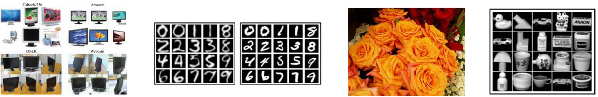
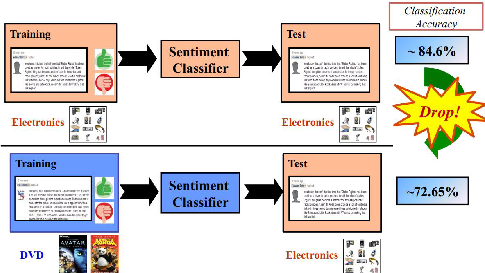
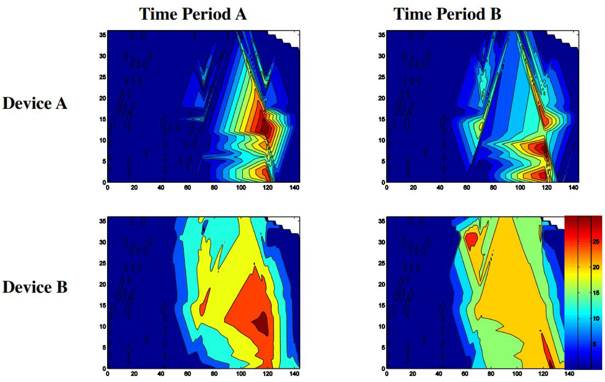

# 第3章 迁移学习的应用

迁移学习是机器学习领域的一个重要分支。因此，其应用并不局限于特定的领域。凡是满足迁移学习问题情景的应用，迁移学习都可以发挥作用。这些领域包括但不限于计算机视觉、文本分类、行为识别、自然语言处理、室内定位、视频监控、舆情分析、人机交互等。下展示了迁移学习可能的应用领域。

下面我们选择几个研究热点，对迁移学习在这些领域的应用场景作一简单介绍。

## 计算机视觉

迁移学习已被广泛地应用于计算机视觉的研究中。特别地，在计算机视觉中，迁移学习方法被称为Domain Adaptation。Domain adaptation的应用场景有很多，比如图片分类、图片哈希等。

下图展示了不同的迁移学习图片分类任务示意。同一类图片，不同的拍摄角度、不同光照、不同背景，都会造成特征分布发生改变。因此，使用迁移学习构建跨领域的鲁棒分类器是十分重要的。

计算机视觉三大顶会(CVPR、ICCV、ECCV)每年都会发表大量的文章对迁移学习在视觉领域的应用进行介绍。

## 文本分类

由于文本数据有其领域特殊性，因此，在一个领域上训练的分类器，不能直接拿来作用到另一个领域上。这就需要用到迁移学习。例如，在电影评论文本数据集上训练好的分类器，不能直接用于图书评论的预测。这就需要进行迁移学习。下图是一个由电子产品评论迁移到DVD评论的迁移学习任务。

文本和网络领域顶级会议WWW和CIKM每年有大量的文章对迁移学习在文本领域的应用作介绍。

## 时间序列

**行为识别 (Activity Recognition)**主要通过佩戴在用户身体上的传感器，研究用户的行为。行为数据是一种时间序列数据。不同用户、不同环境、不同位置、不同设备，都会导致时间序列数据的分布发生变化。此时，也需要进行迁移学习。下图展示了同一用户不同位置的信号差异性。在这个领域，华盛顿州立大学的Diane Cook等人在2013年发表的关于迁移学习在行为识别领域的综述文章"[Transfer learning for activity recognition: a survey](https://link.springer.com/article/10.1007/s10115-013-0665-3)"是很好的参考资料。

**室内定位 (Indoor Location)**与传统的室外用GPS定位不同，它通过WiFi、蓝牙等设备研究人在室内的位置。不同用户、不同环境、不同时刻也会使得采集的信号分布发生变化。下图展示了不同时间、不同设备的WiFi信号变化。

## 医疗健康

医疗健康领域的研究正变得越来越重要。不同于其他领域，医疗领域研究的难点问题是，无法获取足够有效的医疗数据。在这一领域，迁移学习同样也变得越来越重要。

最近，顶级生物期刊细胞杂志报道了由张康教授领导的广州妇女儿童医疗中心和加州大学圣迭戈分校团队的重磅研究成果：基于深度学习开发出一个能诊断眼病和肺炎两大类疾病的[AI系统](https://www.sciencedirect.com/science/article/pii/S0092867418301545)，准确性匹敌顶尖医生。这不仅是中国研究团队首次在顶级生物医学杂志发表有关医学人工智能的研究成果；也是世界范围内首次使用如此庞大的标注好的高质量数据进行迁移学习，并取得高度精确的诊断结果，达到匹敌甚至超越人类医生的准确性；还是全世界首次实现用AI精确推荐治疗手段。细胞杂志封面报道了该研究成果。

我们可以预见到的是，迁移学习对于那些不易获取标注数据的领域，将会发挥越来越重要的作用。