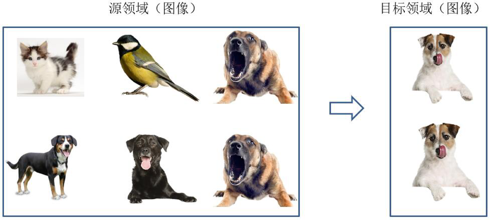
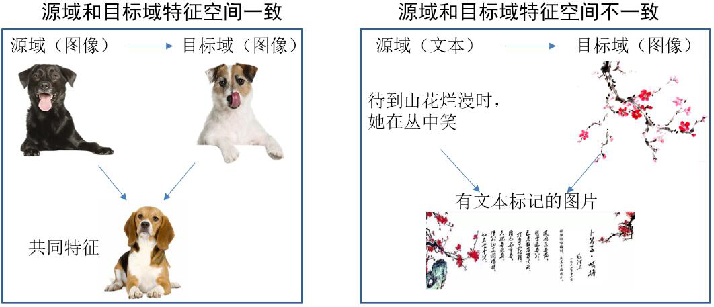
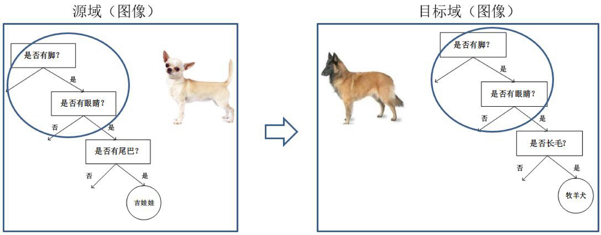
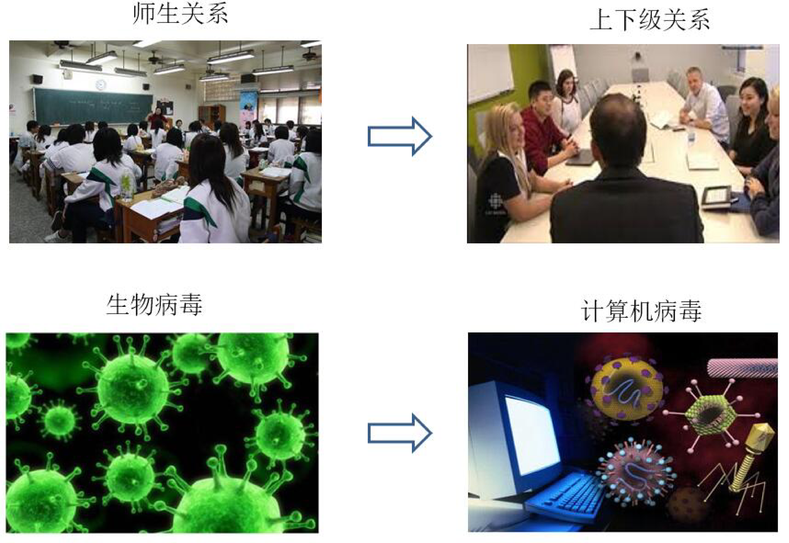
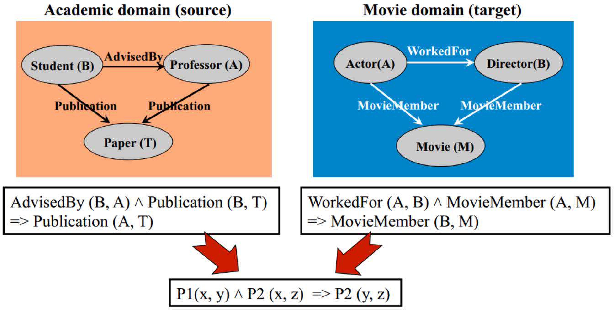

# 第5章 迁移学习的基本方法

按照迁移学习领域权威综述文章A survey on transfer learning，迁移学习的基本方法可以分为四种。这四种基本的方法分别是：**基于样本的迁移**，**基于模型的迁移**，**基于特征的迁移**，及**基于关系的迁移**。

本部分简要叙述各种方法的基本原理和代表性相关工作。基于特征和模型的迁移方法是我们的重点。因此，在后续的章节中，将会更加深入地讨论和分析。

# 基于样本迁移

基于样本的迁移学习方法(Instance based Transfer Learning)根据一定的权重生成规则，对数据样本进行重用，来进行迁移学习。下图形象地表示了基于样本迁移方法的思想。源域中存在不同种类的动物，如狗、鸟、猫等，目标域只有狗这一种类别。在迁移时，为了最大限度地和目标域相似，我们可以人为地**提高**源域中属于狗这个类别的样本权重。

在迁移学习中，对于源域$$\mathcal{D}_s$$和目标域$$\mathcal{D}_t$$，通常假定产生它们的概率分布是不同且未知的($$P(\mathbf{x}_s) \ne P(\mathbf{x}_t)$$)。另外，由于实例的维度和数量通常都非常大，因此，直接对$$P(\mathbf{x}_s)$$和$$P(\mathbf{x}_t)$$进行估计是不可行的。因而，大量的研究工作[khan2016adapting](https://ieeexplore.ieee.org/abstract/document/7899859), [zadrozny2004learning](https://dl.acm.org/citation.cfm?id=1015425), [cortes2008sample](https://link.springer.com/chapter/10.1007/978-3-540-87987-9_8), [dai2007boosting](https://dl.acm.org/citation.cfm?id=1273521), [tan2015transitive](https://dl.acm.org/citation.cfm?id=2783295), [tan2017distant](https://www.aaai.org/ocs/index.php/AAAI/AAAI17/paper/viewPaper/14446)着眼于对源域和目标域的分布比值进行估计($$P(\mathbf{x}_t)/P(\mathbf{x}_s)$$)。所估计得到的比值即为样本的权重。这些方法通常都假设$$\frac{P(\mathbf{x}_t)}{P(\mathbf{x}_s)}<\infty$$并且源域和目标域的条件概率分布相同($$P(y|\mathbf{x}_s)=P(y|\mathbf{x}_t)$$)。

特别地，上海交通大学Dai等人提出了TrAdaboost方法，将AdaBoost的思想应用于迁移学习中，提高有利于目标分类任务的实例权重、降低
不利于目标分类任务的实例权重，并基于PAC理论推导了模型的泛化误差上界。TrAdaBoost方法是此方面的经典研究之一。文献[huang2007correcting](http://papers.nips.cc/paper/3075-correcting-sample-selection-bias-by-unlabeled-data.pdf)提出核均值匹配方法(Kernel Mean Matching, KMM)对于概率分布进行估计，目标是使得加权后的源域和目标域的概率分布尽可能相近。

在最新的研究成果中，香港科技大学的Tan等人扩展了实例迁移学习方法的应用场景，提出了传递迁移学习方法(Transitive Transfer Learning, TTL, [tan2015transitive](https://dl.acm.org/citation.cfm?id=2783295))和远域迁移学习(Distant Domain Transfer Learning, DDTL) [tan2017distant](https://www.aaai.org/ocs/index.php/AAAI/AAAI17/paper/viewPaper/14446)，利用联合矩阵分解和深度神经网络，将迁移学习应用于多个不相似的领域之间的知识共享，取得了良好的效果。

虽然实例权重法具有较好的理论支撑、容易推导泛化误差上界，但这类方法通常只在领域间分布差异较小时有效，因此对自然语言处理、计算机视觉等任务效果并不理想。而基于特征表示的迁移学习方法效果更好，是我们研究的重点。

# 基于特征迁移

基于特征的迁移方法(Feature based Transfer Learning)是指将通过特征变换的方式互相迁移，例如[liu2011cross](https://ieeexplore.ieee.org/abstract/document/5995729), [zheng2008transferring](https://www.aaai.org/Papers/AAAI/2008/AAAI08-226.pdf), [hu2011transfer](https://www.aaai.org/ocs/index.php/IJCAI/IJCAI11/paper/viewPaper/3275)等，来减少源域和目标域之间的差距；或者将源域和目标域的数据特征变换到统一特征空间中，例如[pan2011domain](https://ieeexplore.ieee.org/abstract/document/5640675), [duan2012domain](https://ieeexplore.ieee.org/abstract/document/6136518)，[wang2017balanced](https://ieeexplore.ieee.org/abstract/document/8215613)等，然后利用传统的机器学习方法进行分类识别。根据特征的同构和异构性，又可以分为同构和异构迁移学习。

下图很形象地表示了两种基于特征的迁移学习方法。

基于特征的迁移学习方法是迁移学习领域中**最热门**的研究方法，这类方法通常假设源域和目标域间有一些交叉的特征。香港科技大学的Pan等人[pan2011domain](https://ieeexplore.ieee.org/abstract/document/5640675)提出的迁移成分分析方法(Transfer Component Analysis, TCA)是其中较为典型的一个方法。该方法的核心内容是以[最大均值差异(Maximum Mean Discrepancy, MMD)](https://academic.oup.com/bioinformatics/article-abstract/22/14/e49/228383)作为度量准则，将不同数据领域中的分布差异最小化。加州大学伯克利分校的[Blitzer等人](https://dl.acm.org/citation.cfm?id=1610094)提出了一种基于结构对应的学习方法(Structural Corresponding Learning, SCL)，该算法可以通过映射将一个空间中独有的一些特征变换到其他所有空间中的轴特征上，然后在该特征上使用机器学习的算法进行分类预测。

清华大学[龙明盛等人](https://www.cv-foundation.org/openaccess/content_cvpr_2014/html/Long_Transfer_Joint_Matching_2014_CVPR_paper.html)提出在最小化分布距离的同时，加入实例选择的迁移联合匹配(Tranfer Joint Matching, TJM)方法，将实例和特征迁移学习方法进行了有机的结合。澳大利亚卧龙岗大学的[Jing Zhang等人](http://openaccess.thecvf.com/content_cvpr_2017/html/Zhang_Joint_Geometrical_and_CVPR_2017_paper.html)提出对于源域和目标域各自训练不同的变换矩阵，从而达到迁移学习的目标。

近年来，基于特征的迁移学习方法大多与神经网络进行结合，如[long2015learning](http://www.jmlr.org/proceedings/papers/v37/long15.pdf)，[sener2016learning](http://papers.nips.cc/paper/6360-learning-transferrable-representations-for-unsupervised-domain-adaptation)，[wang2019transfer](https://arxiv.org/abs/1909.08531v1)等。这些方法在神经网络的训练中进行学习特征和模型的迁移。

由于本文的研究重点即是基于特征的迁移学习方法，因此，我们在本小节对这类方法不作过多介绍。在下一小节中，我们将从不同的研究层面，系统地介绍这类工作。

# 基于模型迁移

基于模型的迁移方法(Parameter/Model based Transfer Learning)是指从源域和目标域中找到他们之间共享的参数信息，以实现迁移的方法。这种迁移方式要求的假设条件是：**源域中的数据与目标域中的数据可以共享一些模型的参数**。其中的代表性工作主要有[zhao2010cross](https://dl.acm.org/citation.cfm?id=2505603), [zhao2011cross](https://www.aaai.org/ocs/index.php/IJCAI/IJCAI11/paper/viewPaper/2983), [pan2008transferring](https://www.aaai.org/Papers/AAAI/2008/AAAI08-219.pdf), [pan2008transfer](http://new.aaai.org/Papers/AAAI/2008/AAAI08-108.pdf)。

下图形象地表示了基于模型的迁移学习方法的基本思想。

其中，中科院计算所的Zhao等人([zhao2010cross](https://dl.acm.org/citation.cfm?id=2505603))提出了TransEMDT方法。该方法首先针对已有标记的数据，利用决策树构建鲁棒性的行为识别模型，然后针对无标定数据，利用K-Means聚类方法寻找最优化的标定参数。西安邮电大学的Deng等人([deng2014cross](https://www.sciencedirect.com/science/article/abs/pii/S0893608014000203))也用超限学习机做了类似的工作。香港科技大学的Pan等人([pan2008transfer](http://new.aaai.org/Papers/AAAI/2008/AAAI08-108.pdf))利用HMM，针对Wifi室内定位在不同设备、不同时间和不同空间下动态变化的特点，进行不同分布下的室内定位研究。

另一部分研究人员对支持向量机SVM进行了改进研究([nater2011transferring](https://ieeexplore.ieee.org/abstract/document/6130459)，[li2012cross](https://www.sciencedirect.com/science/article/pii/S0957417412006513))。这些方法假定SVM中的权重向量$$\mathbf{w}$$可以分成两个部分：$$\mathbf{w}=\mathbf{w_o}+\mathbf{v}$$，其中$$\mathbf{w}_0$$代表源域和目标域的共享部分，$$\mathbf{v}$$代表了对于不同领域的特定处理。在最新的研究成果中，香港科技大学的Wei等人([wei2016instilling](https://www.aaai.org/ocs/index.php/AAAI/AAAI16/paper/viewPaper/12308))将社交信息加入迁移学习方法的正则项中，对方法进行了改进。清华大学龙明盛等人([long2015learning](http://www.jmlr.org/proceedings/papers/v37/long15.pdf))改进了深度网络结构，通过在网络中加入概率分布适配层，进一步提高了深度迁移学习网络对于大数据的泛化能力。

通过对现有工作的调研可以发现，目前绝大多数基于模型的迁移学习方法都与深度神经网络进行结合([long2015learning](http://www.jmlr.org/proceedings/papers/v37/long15.pdf), [sener2016learning](http://papers.nips.cc/paper/6360-learning-transferrable-representations-for-unsupervised-domain-adaptation)，[wang2019transfer](https://arxiv.org/abs/1909.08531v1))。这些方法对现有的一些神经网络结构进行修改，在网络中加入领域适配层，然后联合进行训练。因此，这些方法也可以看作是基于模型、特征的方法的结合。

# 基于关系迁移

基于关系的迁移学习方法(Relation Based Transfer Learning)与上述三种方法具有截然不同的思路。这种方法比较关注源域和目标域的样本之间的关系。下图形象地表示了不同领域之间相似的关系。

就目前来说，基于关系的迁移学习方法的相关研究工作非常少，仅有几篇连贯式的文章讨论：[mihalkova2007mapping](http://new.aaai.org/Papers/AAAI/2007/AAAI07-096.pdf), [mihalkova2008transfer](https://www.aaai.org/Papers/Workshops/2008/WS-08-13/WS08-13-006.pdf), [davis2009deep](https://dl.acm.org/citation.cfm?id=1553402)。这些文章都借助于马尔科夫逻辑网络(Markov Logic Net)来挖掘不同领域之间的关系相似性。

我们将重点讨论基于特征和基于模型的迁移学习方法，这也是目前绝大多数研究工作的热点。