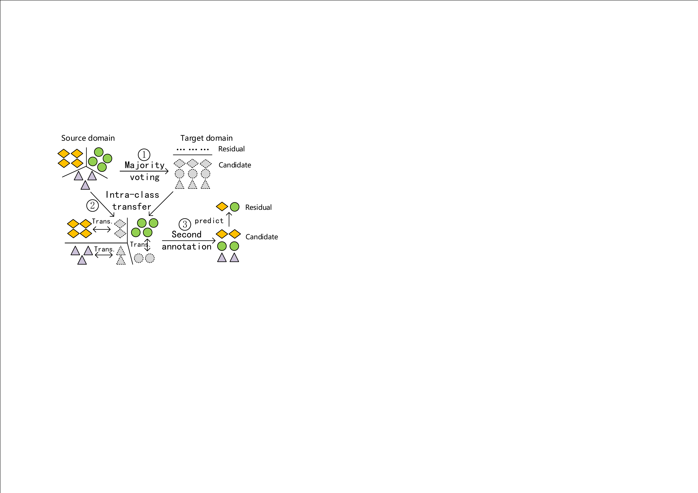

# 条件分布自适应

条件分布自适应方法(Conditional Distribution Adaptation)的目标是减小源域和目标域的条件概率分布的距离，从而完成迁移学习。从形式上来说，条件分布自适应方法是用$$P(y_s|\mathbf{x}_s)$$和$$P(y_t|\mathbf{x}_t)$$之间的距离来近似两个领域之间的差异。即：

$$
DISTANCE(\mathcal{D}_s,\mathcal{D}_t) \approx ||P(y_s|\mathbf{x}_s) - P(y_t|\mathbf{x}_t)||
$$

条件分布自适应对应于上一页图中由source迁移到第二类target的情形。

目前单独利用条件分布自适应的工作较少。最近，中科院计算所的Wang等人提出了[STL方法(Stratified Transfer Learning)](https://ieeexplore.ieee.org/abstract/document/8444572/)。作者提出了**类内迁移(Intra-class Transfer)**的思想。指出现有的绝大多数方法都只是学习一个全局的特征变换(Global Domain Shift)，而忽略了类内的相似性。类内迁移可以利用类内特征，实现更好的迁移效果。

STL方法的基本思路如下图所示。首先利用大多数投票的思想，对无标定的位置行为生成伪标签；然后在再生核希尔伯特空间中，利用类内相关性进行自适应地空间降维，使得不同情境中的行为数据之间的相关性增大；最后，通过二次标定，实现对未知标定数据的精准标定。

为了实现类内迁移，我们需要计算每一类别的MMD距离。由于目标域没有标记，作者使用来自大多数投票结果中的伪标记。更加准确地说，用$$c \in \{1, 2, \cdots, C\}$$来表示类别标记，则类内迁移可以按如下方式计算:

$$
D(\mathcal{D}_{s},\mathcal{D}_{t})
=\sum_{c=1}^{C}\left \Vert \frac{1}{n^{(c)}_1} \sum_{\mathbf{x}_i \in \mathcal{D}^{(c)}_s} \phi(\mathbf{x}_i) - \frac{1}{n^{(c)}_2} \sum_{\mathbf{x}_j \in \mathcal{D}^{(c)}_t} \phi(\mathbf{x}_j) \right \Vert ^2_\mathcal{H}
$$

其中，$$\mathcal{D}^{(c)}_s$$和$$\mathcal{D}^{(c)}_t$$分别表示源域和目标域中属于类别$$c$$的样本。$$n^{(c)}_1=|\mathcal{D}^{(c)}_s|$$，且$$n^{(c)}_2=|\mathcal{D}_t|$$。

接下来的步骤请参照STL方法原文进行理解。

STL方法在大量行为识别数据中进行了跨位置行为识别的实验。实验结果表明，该方法可以很好地实现跨领域的行为识别任务，取得了当前最好的效果。

STL提出之后，最近有一些方法沿袭了相应的思路，分别将其应用于深度网络语义匹配([MSTN](http://proceedings.mlr.press/v80/xie18c.html))、类间对抗迁移([MADA](https://www.aaai.org/ocs/index.php/AAAI/AAAI18/paper/viewPaper/17067))等，大大提高了迁移学习方法的效果和精度。