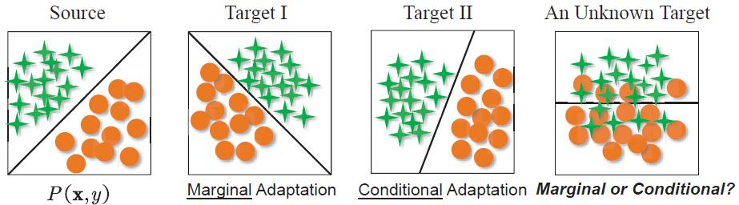

第6章 数据分布自适应方法

数据分布自适应(Distribution Adaptation)是一类最常用的迁移学习方法。这种方法的基本思想是，由于源域和目标域的数据概率分布不同，那么最直接的方式就是通过一些变换，将不同的数据分布的距离拉近。

下图形象地表示了几种数据分布的情况。(图源：[yu2019transfer](http://jd92.wang/assets/files/a16_icdm19.pdf))

> 简单来说，数据的边缘分布不同，就是数据整体不相似。数据的条件分布不同，就是数据整体相似，但是具体到每个类里，都不太相似。

根据数据分布的性质，这类方法又可以分为**边缘分布自适应**、**条件分布自适应**、以及**联合分布自适应**。最近的研究成果又提出了**动态分布自适应**。下面我们分别介绍每类方法的基本原理和代表性研究工作。介绍每类研究工作时，我们首先给出基本思路，然后介绍该类方法的核心，最后结合最近的相关工作介绍该类方法的扩展。

总的来说，四种概率分布适配方法的比较如下：

- 精度比较：DDA > JDA > TCA > 条件分布自适应。
- 将不同的概率分布自适应方法用于神经网络，是一个发展趋势。将概率分布适配加入深度网络中，往往会取得比非深度方法更好的结果。 