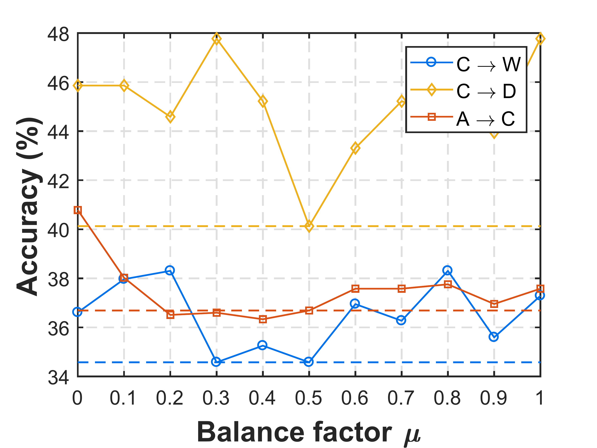
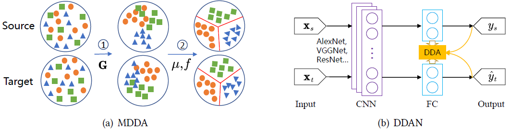

# 动态分布自适应

## 平衡分布自适应BDA

在最近的研究中，来自中科院计算所的Wang等人注意到了JDA的不足：**边缘分布自适应和条件分布自适应并不是同等重要**。回到下图表示的两种分布的问题上来。显然，当目标域是Source迁移到Target I所示的情况时，边缘分布应该被优先考虑；而当目标域是Source迁移到Target II所示的情况时，条件分布应该被优先考虑。JDA以及后来的扩展工作均忽视了这一问题。

作者提出了[BDA方法(Balanced Distribution Adaptation)](https://ieeexplore.ieee.org/abstract/document/8215613/)来解决这一问题。该方法能够根据特定的数据领域，自适应地调整分布适配过程中边缘分布和条件分布的重要性。准确而言，BDA通过采用一种**平衡因子**$$\mu$$来动态调整两个分布之间的距离
$$
DISTANCE(\mathcal{D}_s,\mathcal{D}_t) \approx  (1 - \mu)DISTANCE(P(\mathbf{x}_s),P(\mathbf{x}_t)) + \mu DISTANCE(P(y_s|\mathbf{x}_s),P(y_t|\mathbf{x}_t))
$$

其中$$\mu \in [0,1]$$表示平衡因子。当$$\mu \rightarrow 0$$，这表示源域和目标域数据本身存在较大的差异性，因此，边缘分布适配更重要；当$$\mu \rightarrow 1$$时，这表示源域和目标域数据集有较高的相似性，因此，条件概率分布适配更加重要。综合上面的分析可知，平衡因子可以根据实际数据分布的情况，动态地调节每个分布的重要性，并取得良好的分布适配效果。

其中的平衡因子$$\mu$$可以通过分别计算两个领域数据的整体和局部的$$\mathcal{A}$$-distance近似给出。特别地，当$$\mu = 0$$时，方法退化为TCA；当$$\mu = 0.5$$时，方法退化为JDA。

我们采用BDA文章中的图来具体地展示出$$\mu$$的作用。下图的结果清晰地显示出，平衡因子可以取得比JDA、TCA更小的MMD距离、更高的精度。

## 动态分布自适应

BDA方法是首次给出边缘分布和条件分布的定量估计。然而，其并未解决平衡因子$$\mu$$的精确计算问题。最近，作者扩展了BDA方法，提出了一个更具普适性的动态迁移框架[DDA(Dynamic Distribution Adaptation)](https://dl.acm.org/citation.cfm?id=3240512)来解决$$\mu$$值的精确估计问题。

注意到，可以简单地将$$\mu$$视为一个迁移过程中的参数，通过交叉验证 (cross-validation)来确定其最优的取值$$\mu_{opt}$$。然而，在本章的无监督迁移学习问题定义中，目标域完全没有标记，故此方式不可行。有另外两种非直接的方式可以对$$\mu$$值进行估计：随机猜测和最大最小平均法。随机猜测从神经网络随机调参中得到启发，指的是任意从$$[0,1]$$区间内选择一个$$\mu$$的值，然后进行动态迁移，其并不算是一种技术严密型的方案。如果重复此过程$$t$$次，记第$$t$$次的迁移学习结果为$$r_t$$，则随机猜测法最终的迁移结果为$$r_{rand} = \frac{1}{t} \sum_{i=1}^{t} r_t$$。最大最小平均法与随机猜测法相似，可以在$$[0,1]$$区间内从0开始取$$\mu$$的值，每次增加0.1，得到一个集合$$[0,0.1,\cdots,0.9,1.0]$$，然后，与随机猜测法相似，也可以得到其最终迁移结果$$r_{maxmin}=\frac{1}{11} \sum_{i=1}^{11} r_i$$。

然而，尽管上述两种估计方案有一定的可行性，它们均需要大量的重复计算，给普适计算设备带来了严峻的挑战。另外，上述结果并不具有可解释性，其正确性也无法得到保证。

作者提出的动态迁移方法是首次对$$\mu$$值进行精确的定量估计方法。该方法利用领域的整体和局部性质来定量计算$$\mu$$(计算出的值用$$\hat{\mu}$$来表示）。采用$$\mathcal{A}-distance$$~\cite{ben2007analysis}作为基本的度量方式。$$\mathcal{A}-distance$$被定义为建立一个二分类器进行两个不同领域的分类得出的误差。从形式化来看，定义$$\epsilon(h)$$作为线性分类器$$h$$区分两个领域$$\Omega_s$$和$$\Omega_t$$的误差。则，$$\mathcal{A}-distance$$可以被定义为：
$$
d_A(\Omega_s,\Omega_t) = 2(1 - 2 \epsilon(h)).
$$

直接根据上式计算边缘分布的$$\mathcal{A}-distance$$，将其用$$d_M$$来表示。对于条件分布之间的$$\mathcal{A}-distance$$，用$$d_c$$来表示对应于类别$$c$$的条件分布距离。它可以由式$$d_c = d_A(\Omega^{(c)}_s,\Omega^{(c)}_t)$$进行计算，其中$$\Omega^{(c)}_s$$和$$\Omega^{(c)}_t$$分别表示来自源域和目标域的第$$c$$个类的样本。最终，$$\mu$$可以由下式进行计算：
$$
\hat{\mu} = 1 - \frac{d_M}{d_M + \sum_{c=1}^{C} d_c}.
$$

由于特征的动态和渐近变化性，此估计需要在每一轮迭代中给出。值得注意的是，这是**首次**给出边缘分布和条件分布的定量估计，对于迁移学习研究具有很大的意义。

具体而言，作者将机器学习问题规约成一个统计机器学习问题，可以用统计机器学习中的结构风险最小化的原则(Structural Risk Minimization, SRM)~\cite{belkin2006manifold,vapnik1998statistical}进行表示学习。在SRM中，分类器$$f$$可以被表示为：
$$
f = \mathop{\arg\min}_{f \in \mathcal{H}_{K}, (\mathbf{x},y) \sim \Omega_l} J(f(\mathbf{x}),y) + R(f),
$$
其中第一项表示$$f$$在有标记数据上的损失，第二项为正则项，$$\mathcal{H}_{K}$$表示核函数$$K(\cdot,\cdot)$$构造的希尔伯特空间 (Hilbert space)。符号$$\Omega_l$$表示有标记的数据领域。在本章的问题中，$$\Omega_l = \Omega_s$$，即只有源域数据有标记。特别地，由于在迁移学习问题中，源域和目标域数据有着不同的数据分布，为了表示此分布距离，可以进一步将正则项表示成如下的形式：
$$
R(f) = \lambda \overline{D_f}(\Omega_s,\Omega_t) + R_f(\Omega_s,\Omega_t),
$$
其中$$\overline{D_f}(\cdot, \cdot)$$表示$$\Omega_s$$和$$\Omega_t$$的分布距离，$$\lambda$$为平衡系数，$$R_f(\cdot, \cdot)$$则为其他形式的正则项。根据公式~(\ref{eq-meda-srm})中的结构风险最小化公式，如果用$$g(\cdot)$$来表示特征学习过程，则$$f$$可以被表示为：
$$
f = \mathop{\arg\min}_{f \in \sum_{i=1}^{n} \mathcal{H}_{K}} J(f(g(\mathbf{x}_i)),y_i) + \eta ||f||^2_K + \lambda \overline{D_f}(\Omega_s,\Omega_t) + \rho R_f(\Omega_s,\Omega_t),
$$
其中$$||f||^2_K$$是$$f$$的平方标准形式。$$\overline{D_f}(\cdot,\cdot)$$这一项表示本章提出的动态迁移学习。引入拉普拉斯约束作为$$f$$的额外正则项~\cite{belkin2006manifold}。$$\eta,\lambda$$,和$$\rho$$是对应的正则项系数。

上式则为通用的一个迁移学习框架，可以适用于任何问题。为了对此框架进行学习，作者分别提出了[基于流形学习的动态迁移方法MEDA (Manifold Embedded Distribution Alignment)](https://dl.acm.org/citation.cfm?id=3240512)和[基于深度学习的动态迁移方法DDAN (Deep Dynamic Adaptation Network)](https://arxiv.org/abs/1909.08184)来进行学习。这两种方法分别如下图所示。

最近，作者在[yu2019transfer](http://jd92.wang/assets/files/a16_icdm19.pdf)中将DDA的概念进一步扩展到了对抗网络中，证明了对抗网络中同样存在边缘分布和条件分布不匹配的问题。作者提出一个动态对抗适配网络DAAN (Dynamic Adversarial Adaptation Networks)来解决对抗网络中的动态分布适配问题，取得了当前的最好效果。下图展示了DAAN的架构。

