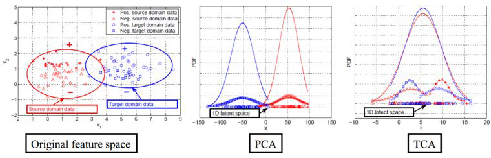

# 边缘分布自适应

## 基本思路

边缘分布自适应方法(Marginal Distribution Adaptation)的目标是减小源域和目标域的边缘概率分布的距离，从而完成迁移学习。从形式上来说，边缘分布自适应方法是用$$P(\mathbf{x}_s)$$和$$P(\mathbf{x}_t)$$之间的距离来近似两个领域之间的差异。即：
$$
	DISTANCE(\mathcal{D}_s,\mathcal{D}_t) \approx ||P(\mathbf{x}_s) - P(\mathbf{x}_t)||
$$

边缘分布自适应对应于前页中由source迁移到第一类target的情形。

## 核心方法

边缘分布自适应的方法最早由香港科技大学杨强教授团队提出，方法名称为[迁移成分分析(Transfer Component Analysis)](https://ieeexplore.ieee.org/abstract/document/5640675)。由于$$P(\mathbf{x}_s) \ne P(\mathbf{x}_t)$$，因此，直接减小二者之间的距离是不可行的。TCA假设存在一个特征映射$$\phi$$，使得映射后数据的分布$$P(\phi(\mathbf{x}_s)) \approx P(\phi(\mathbf{x}_t))$$。TCA假设如果边缘分布接近，那么两个领域的条件分布也会接近，即条件分布$$P(y_s | \phi(\mathbf{x}_s))) \approx P(y_t | \phi(\mathbf{x}_t)))$$。这就是TCA的全部思想。因此，我们现在的目标是，找到这个合适的$$\phi$$。

但是世界上有无穷个这样的$$\phi$$，也许终我们一生也无法找到合适的那一个。庄子说过，吾生也有涯，而知也无涯，以有涯随无涯，殆已！我们肯定不能通过穷举的方法来找$$\phi$$的。那么怎么办呢？

回到迁移学习的本质上来：最小化源域和目标域的距离。好了，我们能不能先假设这个$$\phi$$是已知的，然后去求距离，看看能推出什么呢？

更进一步，这个距离怎么算？机器学习中有很多种形式的距离，从欧氏距离到马氏距离，从曼哈顿距离到余弦相似度，我们需要什么距离呢？TCA利用了一个经典的也算是比较“高端”的距离叫做最大均值差异(MMD，maximum mean discrepancy)。我们令$$n_1,n_2$$分别表示源域和目标域的样本个数，那么它们之间的MMD距离可以计算为：

$$
	DISTANCE(\mathbf{x}_{s},\mathbf{x}_{t})= \begin{Vmatrix} \frac{1}{n_1} \sum \limits_{i=1}^{n_1} \phi(\mathbf{x}_{i}) - \frac{1}{n_2}\sum \limits _{j=1}^{n_2} \phi(\mathbf{x}_{j}) \end{Vmatrix}_{\mathcal{H}}
$$

MMD是做了一件什么事呢？简单，就是求映射后源域和目标域的**均值**之差。

事情到这里似乎也没什么进展：我们想求的$$\phi$$仍然没法求。

TCA是怎么做的呢，这里就要感谢矩阵了！我们发现，上面这个MMD距离平方展开后，有二次项乘积的部分！那么，联系在SVM中学过的核函数，把一个难求的映射以核函数的形式来求，不就可以了？于是，TCA引入了一个核矩阵$$\mathbf{K}$$：

$$
	\mathbf{K}=\begin{bmatrix}\mathbf{K}_{s,s} & \mathbf{K}_{s,t}\\\mathbf{K}_{t,s} & \mathbf{K}_{t,t}\end{bmatrix} 
$$

以及一个MMD矩阵$$\mathbf{L}$$，它的每个元素的计算方式为：

$$
	l_{ij}=\begin{cases} \frac{1}{{n_1}^2} & \mathbf{x}_i,\mathbf{x}_j \in \mathcal{D}_s,\\ \frac{1}{{n_2}^2} & \mathbf{x}_i,\mathbf{x}_j \in \mathcal{D}_t,\\ -\frac{1}{n_1 n_2} & \text{otherwise} \end{cases}
$$

这样的好处是，直接把那个难求的距离，变换成了下面的形式：

$$
	\mathrm{tr}(\mathbf{KL})-\lambda \mathrm{tr}(\mathbf{K})
$$

其中，$$\mathrm{tr}(\cdot)$$操作表示求矩阵的迹，用人话来说就是一个矩阵对角线元素的和。这样是不是感觉离目标又进了一步呢？

其实这个问题到这里就已经是可解的了，也就是说，属于计算机的部分已经做完了。只不过它是一个数学中的半定规划(SDP，semi-definite programming)的问题，解决起来非常耗费时间。由于TCA的第一作者Sinno Jialin Pan以前是中山大学的数学硕士，他想用更简单的方法来解决。他是怎么做的呢？

他想出了用降维的方法去构造结果。用一个更低维度的矩阵$$\mathbf{W}$$：

$$
	\widetilde{\mathbf{K}}=({\mathbf{K}}{\mathbf{K}}^{-1/2}\widetilde{\mathbf{W}})(\widetilde{\mathbf{W}}^{\top}{\mathbf{K}}^{-1/2}{\mathbf{K}})={\mathbf{K}}\mathbf{W} \mathbf{W}^{\top}{\mathbf{K}}
$$

这里的$$\mathbf{W}$$矩阵是比$$\mathbf{K}$$更低维度的矩阵。最后的$$\mathbf{W}$$就是问题的解答了！

好了，问题到这里，整理一下，TCA最后的优化目标是：

$$
	\begin{split} \min_\mathbf{W} \quad& \mathrm{tr}(\mathbf{W}^\top \mathbf{K} \mathbf{L} \mathbf{K} \mathbf{W}) + \mu \mathrm{tr}(\mathbf{W}^\top \mathbf{W})\\ \text{s.t.} \quad & \mathbf{W}^\top \mathbf{K} \mathbf{H} \mathbf{K} \mathbf{W} = \mathbf{I}_m \end{split} 
$$

这里的$$\mathbf{H}$$是一个中心矩阵，$$\mathbf{H} = \mathbf{I}_{n_1 + n_2} - 1/(n_1 + n_2)\mathbf{11}^\top$$.

这个式子下面的条件是什么意思呢？那个$$\min$$的目标我们大概理解，就是要最小化源域和目标域的距离，加上$$\mathbf{W}$$的约束让它不能太复杂。那么下面的条件是什么呢？下面的条件就是要实现第二个目标：维持各自的数据特征。

TCA要维持的是什么特征呢？文章中说是variance，但是实际是scatter matrix，就是数据的散度。就是说，一个矩阵散度怎么计算？对于一个矩阵$$\mathbf{A}$$，它的scatter matrix就是$$\mathbf{A} \mathbf{H} \mathbf{A}^\top$$。这个$$\mathbf{H}$$就是上面的中心矩阵啦。

解决上面的优化问题时，作者又求了它的拉格朗日对偶。最后得出结论，$$\mathbf{W}$$的解就是它的前$$m$$个特征值！简单不？数学美不美？

好了，我们现在总结一下TCA方法的步骤。输入是两个特征矩阵，我们首先计算$$\mathbf{L}$$和$$\mathbf{H}$$矩阵，然后选择一些常用的核函数进行映射(比如线性核、高斯核)计算$$\mathbf{K}$$，接着求$$({\mathbf{K}} \mathbf{L} {\mathbf{K}}+\mu \mathbf{I})^{-1}{\mathbf{K}} \mathbf{H}{\mathbf{K}}$$的前$$m$$个特征值。仅此而已。然后，得到的就是源域和目标域的降维后的数据，我们就可以在上面用传统机器学习方法了。

为了形象地展示TCA方法的优势，我们借用TCA的paper中提供的可视化效果，在图中展示了对于源域和目标域数据(红色和蓝色)，分别由PCA(主成分分析)和TCA得到的分布结果。从下中可以很明显地看出，对于概率分布不同的两部分数据，在经过TCA处理后，概率分布更加接近。这说明了TCA在拉近数据分布距离上的优势。

## 扩展

TCA方法是迁移学习领域一个经典的方法，之后的许多研究工作都以TCA为基础。我们列举部分如下：

- [ACA (Adapting Component Analysis)](https://ieeexplore.ieee.org/abstract/document/6413843/): 在TCA中加入HSIC
- [DTMKL (Domain Transfer Multiple Kernel Learning)](https://ieeexplore.ieee.org/abstract/document/6136518/): 在TCA中加入了MK-MMD，用了新的求解方式
- [TJM (Transfer Joint Matching)](https://www.cv-foundation.org/openaccess/content_cvpr_2014/html/Long_Transfer_Joint_Matching_2014_CVPR_paper.html): 在优化目标中同时进行边缘分布自适应和源域样本选择
- [DDC (Deep Domain Confusion)](https://arxiv.org/abs/1412.3474): 将MMD度量加入了深度网络特征层的loss中(我们将会在深度迁移学习中介绍此工作)
- [DAN (Deep Adaptation Network)](http://www.jmlr.org/proceedings/papers/v37/long15.pdf): 扩展了DDC的工作，将MMD换成了MK-MMD，并且进行多层loss计算(我们将会在深度迁移学习中介绍此工作)
- [DME (Distribution Matching Embedding)](http://www.jmlr.org/papers/volume17/15-207/15-207.pdf): 先计算变换矩阵，再进行特征映射(与TCA顺序相反)
- [CMD (Central Moment Matching)](https://arxiv.org/abs/1702.08811): MMD着眼于一阶，此工作将MMD推广到了多阶

## 附加信息

想了解TCA完整推导过程的，可以见这里：https://zhuanlan.zhihu.com/p/63026435。

TCA的Matlab和Python代码可以在这里被找到：https://github.com/jindongwang/transferlearning/tree/master/code/traditional/TCA。