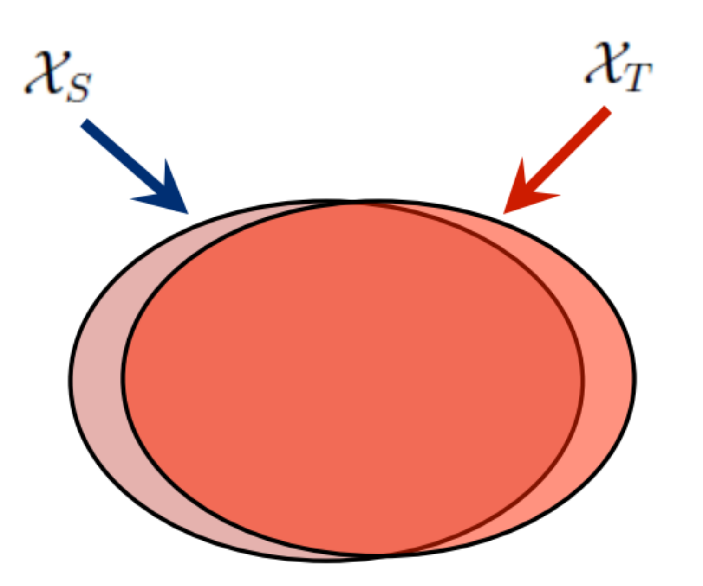
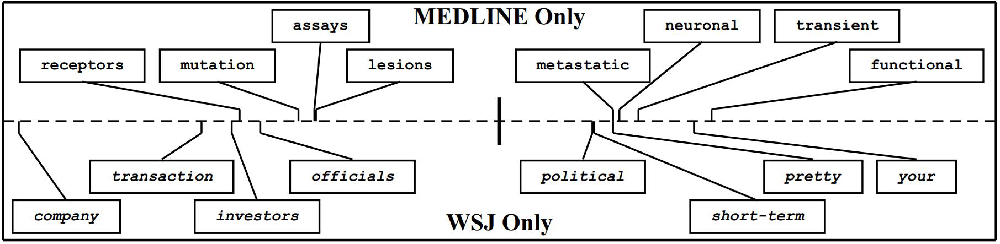

# 特征选择法

特征选择法的基本假设是：源域和目标域中均含有一部分公共的特征，在这部分公共的特征上，源领域和目标领域的数据分布是一致的。因此，此类方法的目标就是，通过机器学习方法，选择出这部分共享的特征，即可依据这些特征构建模型。

下图形象地表示了特征选择法的主要思路。

## 核心方法

这这个领域比较经典的一个方法是发表在2006年的ECML-PKDD会议上，作者提出了一个叫做[SCL的方法(Structural Correspondence Learning)](https://dl.acm.org/citation.cfm?id=1610094)。这个方法的目标就是我们说的，找到两个领域公共的那些特征。作者将这些公共的特征叫做Pivot feature。找出来这些Pivot feature，就完成了迁移学习的任务。

上图形象地展示了Pivot feature的含义。Pivot feature指的是在文本分类中，在不同领域中出现频次较高的那些词。

## 扩展

SCL方法是特征选择方面的经典研究工作。基于SCL，也出现了一些扩展工作。

- [Joint feature selection and subspace learning](https://www.aaai.org/ocs/index.php/IJCAI/IJCAI11/paper/viewPaper/2910)：特征选择+子空间学习
- [TJM (Transfer Joint Matching)](https://www.cv-foundation.org/openaccess/content_cvpr_2014/html/Long_Transfer_Joint_Matching_2014_CVPR_paper.html): 在优化目标中同时进行边缘分布自适应和源域样本选择
- [FSSL (Feature Selection and Structure Preservation)](https://www.ijcai.org/Proceedings/16/Papers/243.pdf): 特征选择+信息不变性

## 小结

- 特征选择法从源域和目标域中选择提取共享的特征，建立统一模型
- 通常与分布自适应方法进行结合
- 通常采用稀疏表示$||\mathbf{A}||_{2,1}$实现特征选择