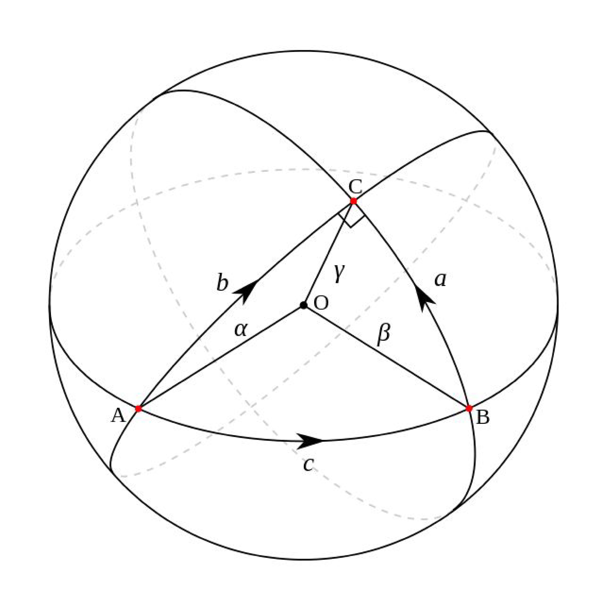
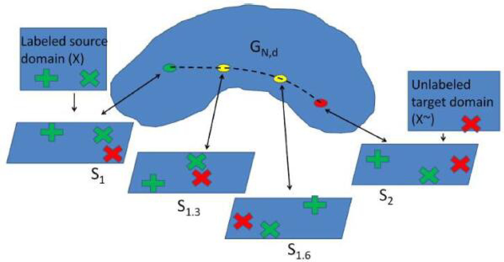
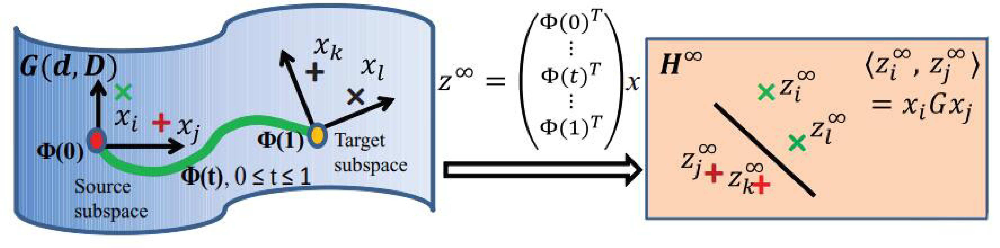

# 流形学习法

流形学习自从2000年在Science上被提出来以后，就成为了机器学习和数据挖掘领域的热门问题。它的基本假设是，现有的数据是从一个**高维空间**中采样出来的，所以，它具有高维空间中的低维流形结构。流形就是一种几何对象(就是我们能想像能观测到的)。通俗点说，我们无法从原始的数据表达形式明显看出数据所具有的结构特征，那我把它想像成是处在一个高维空间，在这个高维空间里它是有个形状的。一个很好的例子就是星座。满天星星怎么描述？我们想像它们在一个更高维的宇宙空间里是有形状的，这就有了各自星座，比如织女座、猎户座。流形学习的经典方法有Isomap、locally linear embedding、laplacian eigenmap等。

流形空间中的距离度量：两点之间什么最短？在二维上是直线（线段），可在三维呢？地球上的两个点的最短距离可不是直线，它是把地球展开成二维平面后画的那条直线。那条线在三维的地球上就是一条曲线。这条曲线就表示了两个点之间的最短距离，我们叫它**测地线**。更通俗一点，两点之间，测地线最短。在流形学习中，我们遇到测量距离的时候，更多的时候用的就是这个测地线。在我们要介绍的GFK方法中，也是利用了这个测地线距离。比如在下面的图中，从A到C最短的距离在就是展开后的线段，但是在三维球体上看，它却是一条曲线。

由于在流形空间中的特征通常都有着很好的几何性质，可以避免特征扭曲，因此我们首先将原始空间下的特征变换到流形空间中。在众多已知的流形中，Grassmann流形$$\mathbb{G}(d)$$可以通过将原始的$$d$$维子空间(特征向量)看作它基础的元素，从而可以帮助学习分类器。在Grassmann流形中，特征变换和分布适配通常都有着有效的数值形式，因此在迁移学习问题中可以被很高效地表示和求解[~\cite{]hamm2008grassmann](https://dl.acm.org/citation.cfm?id=1390204)。因此，利用Grassmann流形空间中来进行迁移学习是可行的。现存有很多方法可以将原始特征变换到流形空间中([gopalan2011domain](https://ieeexplore.ieee.org/abstract/document/6126344/), [baktashmotlagh2014domain](https://www.cv-foundation.org/openaccess/content_cvpr_2014/html/Baktashmotlagh_Domain_Adaptation_on_2014_CVPR_paper.html))。

## GFK方法

在众多的基于流形变换的迁移学习方法中，[GFK(Geodesic Flow Kernel)方法](https://ieeexplore.ieee.org/abstract/document/6247911/)是最为代表性的一个。GFK是在2011年发表在ICCV上的SGF方法[gopalan2011domain](https://ieeexplore.ieee.org/abstract/document/6126344/)发展起来的。我们首先介绍SGF方法。

SGF方法从**增量学习**中得到启发：人类从一个点想到达另一个点，需要从这个点一步一步走到那一个点。那么，如果我们把源域和目标域都分别看成是高维空间中的两个点，由源域变换到目标域的过程不就完成了迁移学习吗？也就是说，**路是一步一步走出来的**。

于是SGF就做了这个事情。它是怎么做的呢？把源域和目标域分别看成高维空间(即Grassmann流形)中的两个点，在这两个点的测地线距离上取$$d$$个中间点，然后依次连接起来。这样，源域和目标域就构成了一条测地线的路径。我们只需要找到合适的每一步的变换，就能从源域变换到目标域了。下图是SGF方法的示意图。

SGF方法的主要贡献在于：提出了这种变换的计算及实现了相应的算法。但是它有很明显的缺点：到底需要找几个中间点？SGF也没能给出答案，就是说这个参数$$d$$是没法估计的，没有一个好的方法。这个问题在GFK中被回答了。

GFK方法首先解决SGF的问题：如何确定中间点的个数$$d$$。它通过提出一种核学习的方法，利用路径上的无穷个点的**积分**，把这个问题解决了。这是第一个贡献。然后，它又解决了第二个问题：当有多个源域的时候，我们如何决定使用哪个源域跟目标域进行迁移？GFK通过提出Rank of Domain度量，度量出跟目标域最近的源域，来解决这个问题。下图是GFK方法的示意图。

用$$\mathcal{S}_s$$和$$\mathcal{S}_t$$分别表示源域和目标域经过主成分分析(PCA)之后的子空间，则G可以视为所有的d维子空间的集合。每一个$$d$$维的原始子空间都可以被看作$$\mathbb{G}$$上的一个点。因此，在两点之间的测地线$$\{\Phi(t):0 \leq t \leq 1\}$$可以在两个子空间之间构成一条路径。如果我们令$$\mathcal{S}_s=\Phi(0)$$，$$\mathcal{S}_t=\Phi(1)$$，则寻找一条从$$\Phi\left(0\right)$$到$$\Phi\left(1\right)$$的测地线就等同于将原始的特征变换到一个无穷维度的空间中，最终减小域之间的漂移现象。这种方法可以被看作是一种从$$\Phi\left(0\right)$$到$$\Phi\left(1\right)$$的增量式“行走”方法。

特别地，流形空间中的特征可以被表示为$$\mathbf{z}=\Phi\left(t\right)^\top \mathbf{x}$$。变换后的特征$$\mathbf{z}_i$$和$$\mathbf{z}_j$$的内积定义了一个半正定(positive semidefinite)的测地线流式核
$$
	\langle\mathbf{z}_i,\mathbf{z}_j\rangle= \int_{0}^{1} (\Phi(t)^T \mathbf{x}_i)^T (\Phi(t)^T \mathbf{x}_j) \, dt = \mathbf{x}^T_i \mathbf{G} \mathbf{x}_j
$$

GFK方法详细的计算过程可以参考原始的文章，我们在这里不再赘述。

GFK的代码可以在这里被找到：https://github.com/jindongwang/transferlearning/tree/master/code/traditional/GFK。

## 扩展与小结

子空间学习方法和概率分布自适应方法可以有机地进行组合，克服各自的缺点。下面是一些相关工作。

- [DIP (Domain-Invariant Projection)](https://www.cv-foundation.org/openaccess/content_iccv_2013/html/Baktashmotlagh_Unsupervised_Domain_Adaptation_2013_ICCV_paper.html): 边缘分布自适应+流形变换
- [baktashmotlagh2014domain](https://www.cv-foundation.org/openaccess/content_cvpr_2014/html/Baktashmotlagh_Domain_Adaptation_on_2014_CVPR_paper.html): 统计流形法，在黎曼流形上进行距离度量。
- [MEDA (Manifold Embedded Distribution Alignment)](http://jd92.wang/assets/files/a11_mm18.pdf): 将GFK流形学习与概率分布适配进行有机结合，达到了很好的效果。