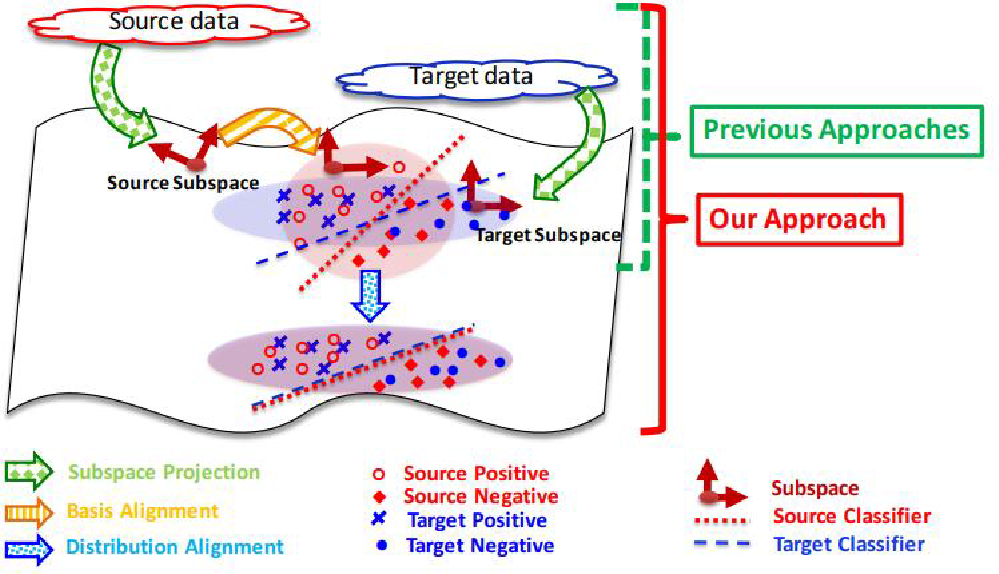
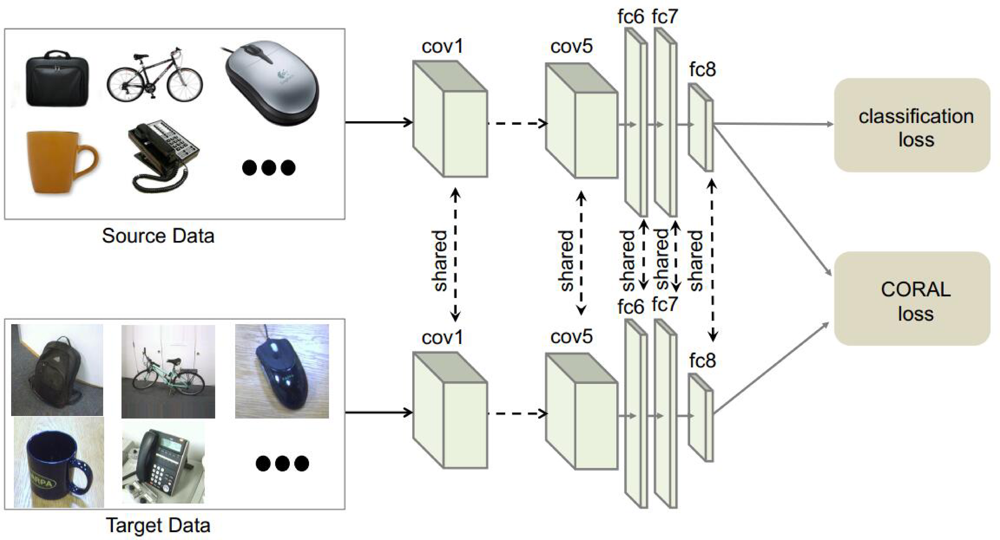

# 统计特征对齐

统计特征对齐方法主要将数据的统计特征进行变换对齐。对齐后的数据，可以利用传统机器学习方法构建分类器进行学习。

## SA方法

SA方法(Subspace Alignment，子空间对齐)([fernando2013unsupervised](http://openaccess.thecvf.com/content_iccv_2013/html/Fernando_Unsupervised_Visual_Domain_2013_ICCV_paper.html))是其中的代表性成果。SA方法直接寻求一个线性变换$$\mathbf{M}$$，将不同的数据实现变换对齐。

SA方法的优化目标如下：

$$
	F(\mathbf{M}) = ||\mathbf{X}_s \mathbf{M} - \mathbf{X}_t||^2_F
$$

则变换$$\mathbf{M}$$的值为：

$$
	\mathbf{M}^\star = \arg \min_\mathbf{M} (F(\mathbf{M}))
$$

可以直接获得上述优化问题的闭式解：

$$
	F(\mathbf{M}) = ||\mathbf{X}^\top_s \mathbf{X}_s \mathbf{M} - \mathbf{X}^\top_s \mathbf{X}_t||^2_F = ||\mathbf{M} - \mathbf{X}^\top_s \mathbf{X}_t||^2_F
$$

SA方法实现简单，计算过程高效，是子空间学习的代表性方法。

## SDA方法

基于SA方法，Sun等人在2015年提出了SDA方法(Subspace Distribution Alignment)([sun2015subspace](http://www.bmva.org/bmvc/2015/papers/paper024/paper024.pdf))。该方法在SA的基础上，加入了概率分布自适应。下图示意了该方法的简单流程。

SDA方法提出，除了子空间变换矩阵$$\mathbf{T}$$之外，还应当增加一个概率分布自适应变换$$\mathbf{A}$$。SDA方法的优化目标如下：

$$
	\mathbf{M} = \mathbf{X}_s \mathbf{T} \mathbf{A} \mathbf{X}^\top_t
$$

## CORAL方法

有别于SA和SDA方法只进行源域和目标域的一阶特征对齐，Sun等人提出了[CORAL方法(CORrelation ALignment)](https://www.aaai.org/ocs/index.php/AAAI/AAAI16/paper/viewPaper/12443)，对两个领域进行二阶特征对齐。假设$$\mathbf{C}_s$$和$$\mathbf{C}_t$$分别是源领域和目标领域的协方差矩阵，则CORAL方法学习一个二阶特征变换$$\mathbf{A}$$，使得源域和目标域的特征距离最小：

$$
	\min_\mathbf{A} ||\mathbf{A}^\top \mathbf{C}_s \mathbf{A} - \mathbf{C}_t||^2_F
$$

CORAL方法的求解同样非常简单且高效。CORAL方法被应用到神经网络中，提出了[DeepCORAL方法](https://link.springer.com/chapter/10.1007/978-3-319-49409-8_35)。作者将CORAL度量作为一个神经网络的损失进行计算。下图展示了DeepCORAL方法的网络结构。

CORAL损失被定义为源域和目标域的二阶统计特征距离：

$$
	\ell_{CORAL} = \frac{1}{4d^2} ||\mathbf{C}_s - \mathbf{C}_t||^2_F
$$