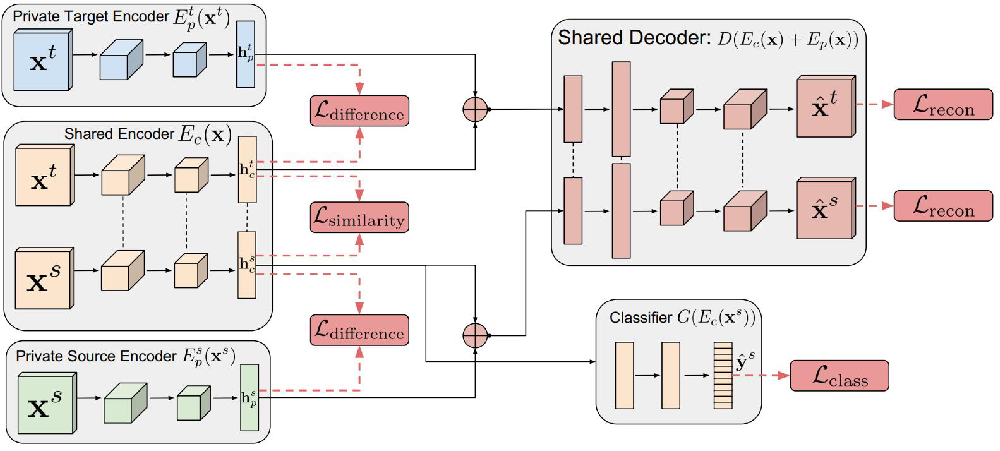
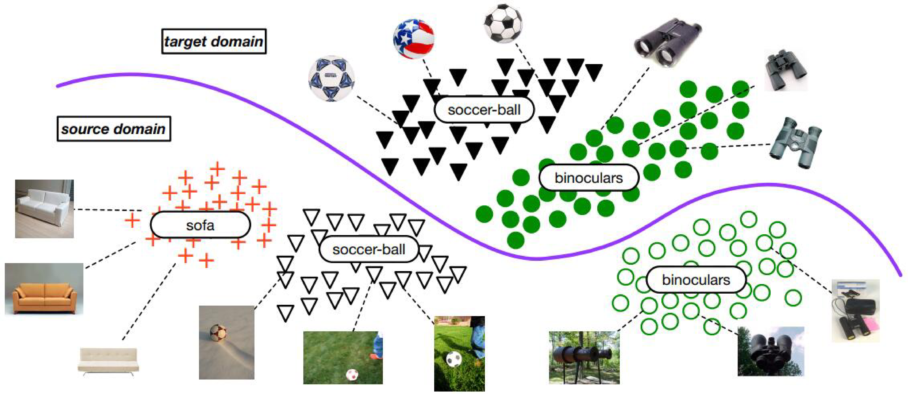

# 深度对抗迁移学习

生成对抗网络GAN(Generative Adversarial Nets)([goodfellow2014generative](http://papers.nips.cc/paper/5423-generative-adversarial-nets))是目前人工智能领域最炙手可热的概念之一。其也被深度学习领军人物Yann Lecun评为近年来最令人欣喜的成就。由此发展而来的对抗网络，也成为了提升网络性能的利器。本小节介绍深度对抗网络用于解决迁移学习问题方面的基本思路以及代表性研究成果。

## 基本思路

GAN受到自博弈论中的二人零和博弈(two-player game)思想的启发而提出。它一共包括两个部分：一部分为生成网络(Generative Network)，此部分负责生成尽可能地以假乱真的样本，这部分被成为**生成器 (Generator)**；另一部分为判别网络(Discriminative Network)，此部分负责判断样本是真实的，还是由生成器生成的，这部分被成为**判别器 (Discriminator)**。生成器和判别器的互相博弈，就完成了对抗训练。

GAN的目标很明确：生成训练样本。这似乎与迁移学习的大目标有些许出入。然而，由于在迁移学习中，天然地存在一个源领域，一个目标领域，因此，我们可以免去生成样本的过程，而直接将其中一个领域的数据(通常是目标域)当作是生成的样本。此时，生成器的职能发生变化，不再生成新样本，而是扮演了特征提取的功能：不断学习领域数据的特征，使得判别器无法对两个领域进行分辨。这样，原来的生成器也可以称为特征提取器(Feature Extractor)。

通常用$$G_f$$来表示特征提取器，用$$G_d$$来表示判别器。

正是基于这样的领域对抗的思想，深度对抗网络可以被很好地运用于迁移学习问题中。

与深度网络自适应迁移方法类似，深度对抗网络的损失也由两部分构成：网络训练的损失$$\ell_c$$和领域判别损失$$\ell_d$$：

$$
	\ell = \ell_c(\mathcal{D}_s,\mathbf{y}_s) + \lambda \ell_d(\mathcal{D}_s,\mathcal{D}_t)
$$

## DANN

Yaroslav Ganin等人首先在神经网络的训练中加入了对抗机制，作者将他们的网络称之为[DANN(Domain-Adversarial Neural Network)](https://arxiv.org/abs/1409.7495)。在此研究中，网络的学习目标是：生成的特征尽可能帮助区分两个领域的特征，同时使得判别器无法对两个领域的差异进行判别。该方法的领域对抗损失函数表示为：

$$
	\ell_d = \max \left[-\frac{1}{n} \sum_{i=1}^{n} \mathcal{L}^i_d(\mathbf{W},\mathbf{b},\mathbf{u},z) - \frac{1}{n'} \sum_{i=n+1}^{N} \mathcal{L}^i_d(\mathbf{W},\mathbf{b},\mathbf{u},z)\right]
$$

其中的$$\mathcal{L}_d$$表示为

$$
	\mathcal{L}_d(G_d(G_f(\mathbf{x}_i)),d_i) = d_i \log \frac{1}{G_d(G_f(\mathbf{x}_i))} + (1 - d_i) \log \frac{1}{G_d(G_f(\mathbf{x}_i))}
$$

## DSN

来自Google Brain的Bousmalis等人通过提出[DSN网络(Domain Separation Networks)](http://papers.nips.cc/paper/6254-domain-separation-networks)对DANN进行了扩展。DSN认为，源域和目标域都由两部分构成：公共部分和私有部分。公共部分可以学习公共的特征，私有部分用来保持各个领域独立的特性。DSN进一步对损失函数进行了定义：

$$
	\ell = \ell_{task} + \alpha \ell_{recon} + \beta \ell_{difference} + \gamma \ell_{similarity}
$$

除去网络的常规训练损失$$\ell_{task}$$外，其他损失的含义如下：

- $$\ell_{recon}$$: 重构损失，确保私有部分仍然对学习目标有作用
- $$\ell_{difference}$$: 公共部分与私有部分的差异损失
- $$\ell_{similarity}$$: 源域和目标域公共部分的相似性损失

下图是DSN方法的示意图。

DDC方法的作者、加州大学伯克利分校的Tzeng等人在2017年发表于计算机视觉顶级会议CVPR上的文章提出了[ADDA方法(Adversarial Discriminative Domain Adaptation)](http://openaccess.thecvf.com/content_cvpr_2017/html/Tzeng_Adversarial_Discriminative_Domain_CVPR_2017_paper.html)。ADDA是一个通用的框架，现有的很多方法都可被看作是ADDA的特例。上海交通大学的研究者们用Wasserstein GAN进行迁移学习([WDGRL](https://arxiv.org/abs/1707.01217))，Liu等人提出了Coupled GAN用于迁移学习([liu2016coupled](http://papers.nips.cc/paper/6544-coupled-generative-adversarial-networks))。这些工作都大体上按照之前思路进行。

## SAN

清华大学龙明盛团队2018年发表在计算机视觉顶级会议CVPR上的文章提出了一个选择性迁移网络[(Partial Transfer Learning)](http://openaccess.thecvf.com/content_cvpr_2018/html/Cao_Partial_Transfer_Learning_CVPR_2018_paper.html)。作者认为，在大数据时代，通常我们会有大量的源域数据。这些源域数据比目标域数据，在类别上通常都是丰富的。比如基于ImageNet训练的图像分类器，必然是针对几千个类别进行的分类。我们实际用的时候，目标域往往只是其中的一部分类别。这样就会带来一个问题：那些只存在于源域中的类别在迁移时，会对迁移结果产生负迁移影响。

这种情况通常来说是非常普遍的。因此，就要求相应的迁移学习方法能够对目标域，选择相似的源域样本(类别)，同时也要避免负迁移。但是目标域通常是没有标签的，不知道和源域中哪个类别更相似。作者指出这个问题叫做partial transfer learning。这个partial，就是只迁移源域中那部分和目标域相关的样本。下图展示了部分迁移学习的思想。

作者提出了一个叫做Selective Adversarial Networks (SAN)的方法来处理partial transfer问题。在partial问题中，传统的对抗网络不再适用。所以就需要对进行一些修改，使得它能够适用于partial问题。

因为不知道目标域的标签，也就没办法知道到底是源域中哪些类是目标域的。为了达到这个目的，作者对目标域按照类别分组，把原来的一整个判别器分成了$$|\mathcal{C}_s|$$个：$$G^k_d$$，每一个子判别器都对它所在的第$$k$$个类进行判别。作者观察到了这样的事实：对于每个数据点$$\mathbf{x}_i$$来说，分类器的预测结果 $$\hat{\mathbf{y}}_i$$ 其实是对于整个类别空间的一个\textit{概率分布}。因此，在进行对抗时，需要考虑每个样本属于每个类别的影响。这个影响就是由概率来刻画。所以作者提出了一个概率权重的判别器：

$$
	L'_d=\frac{1}{n_s+n_t} \sum_{k=1}^{|\mathcal{C}_s|} \sum_{\mathbf{x}_i \in \mathcal{D}_s + \mathcal{D}_t}^{} \hat{y}^k_i L^k_d(G^k_d(G_f(\mathbf{x}_i)),d_i)
$$

上面这个式子能很好地在partial transfer情景下，避免负迁移。这种约束是样本级别的，就是可以控制尽可能让更相似的样本参与迁移。除此之外，作者还介绍了一个类别级别的约束，可以很好地避免不在目标域中的那些类别不参与迁移。于是，进一步地，变成了下面的约束

$$
	L'_d=\frac{1}{n_s+n_t} \sum_{k=1}^{|\mathcal{C}_s|} \sum_{\mathbf{x}_i \in \mathcal{D}_s + \mathcal{D}_t}^{} (\frac{1}{n_t} \sum_{\mathbf{x}_i^{} \in \mathcal{D}_t}\hat{y}^k_i) L^k_d(G^k_d(G_f(\mathbf{x}_i)),d_i)
$$

上面这个式子比较依赖于之前说的每个样本的预测概率。为了消除这个影响，作者又在目标域上加了一项熵最小化

$$
	E=\frac{1}{n_t} \sum_{\mathbf{x}_i \in \mathcal{D}_t} H(G_y(G_f(\mathbf{x}_i)))
$$

## DAAN

最近，Yu等人将动态分布适配的概念进一步扩展到了对抗网络中，证明了对抗网络中同样存在边缘分布和条件分布不匹配的问题。作者提出一个动态对抗适配网络[DAAN (Dynamic Adversarial Adaptation Networks)](http://jd92.wang/assets/files/a16_icdm19.pdf)来解决对抗网络中的动态分布适配问题，取得了当前的最好效果。下图展示了DAAN的架构。

## 小结

使用对抗网络进行迁移学习是近年来的研究热点。我们期待在这个领域会有越来越多的工作发表。