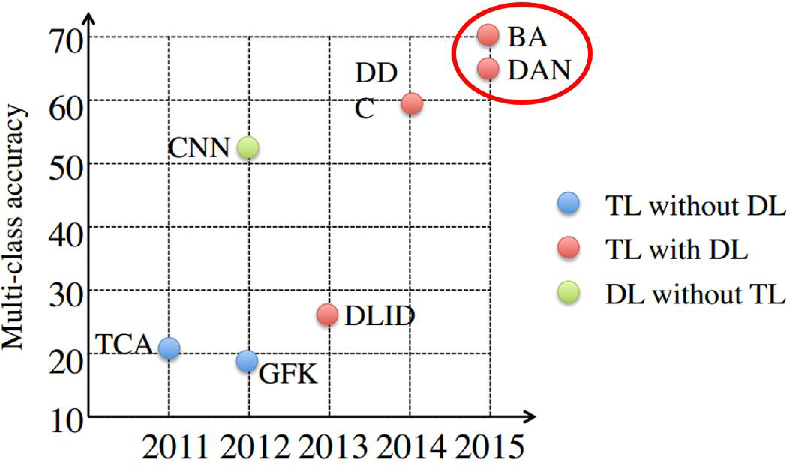

# 第9章深度迁移学习

随着深度学习方法的大行其道，越来越多的研究人员使用深度神经网络进行迁移学习。对比传统的非深度迁移学习方法，深度迁移学习直接提升了在不同任务上的学习效果。并且，由于深度学习直接对原始数据进行学习，所以其对比非深度方法还有两个优势：**自动化地提取更具表现力的特征**，以及**满足了实际应用中的端到端(End-to-End)需求**。

近年来，以生成对抗网络(Generative Adversarial Nets, GAN)([goodfellow2014generative](http://papers.nips.cc/paper/5423-generative-adversarial-nets))为代表的对抗学习也吸引了很多研究者的目光。基于GAN的各种变体网络不断涌现。对抗学习网络对比传统的深度神经网络，极大地提升了学习效果。因此，基于对抗网络的迁移学习，也是一个热门的研究点。

下图展示了近几年的一些代表性方法在相同数据集上的表现。从图中的结果我们可以看出，深度迁移学习方法(BA、DDC、DAN)对比传统迁移学习方法(TCA、GFK等)，在精度上具有无可匹敌的优势。

本部分重点介绍深度迁移学习的基本思路。首先我们回答一个最基本的问题：**为什么深度网络是可迁移的？**然后，我们介绍最简单的深度网络迁移形式：finetune。接着分别介绍使用深度网络和深度对抗网络进行迁移学习的基本思路和核心方法。值得注意的是，由于深度迁移学习方面的研究工作层出不穷，我们不可能覆盖到所有最新的方法。但是基本上这些方法的原理都大同小异。因此，我们的介绍是具有普适性的。