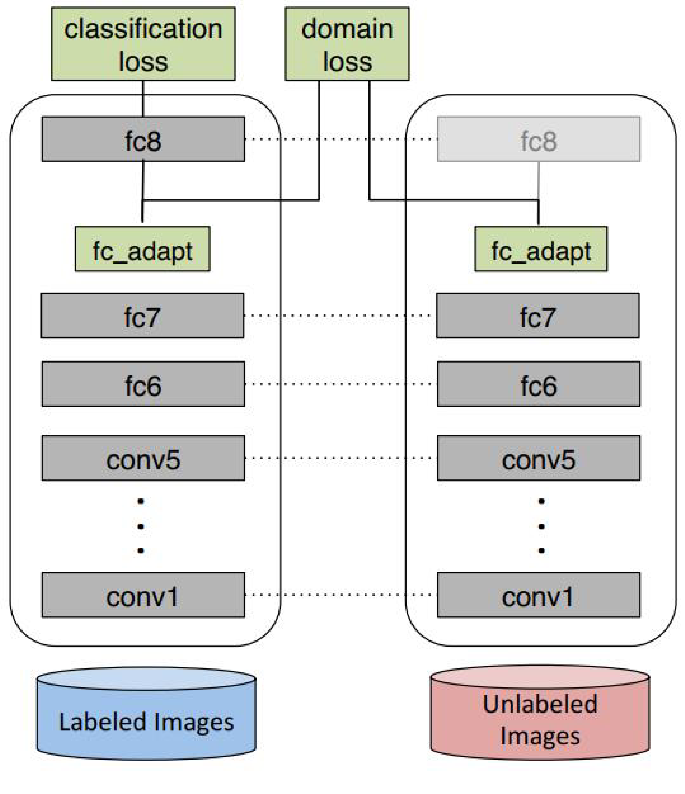
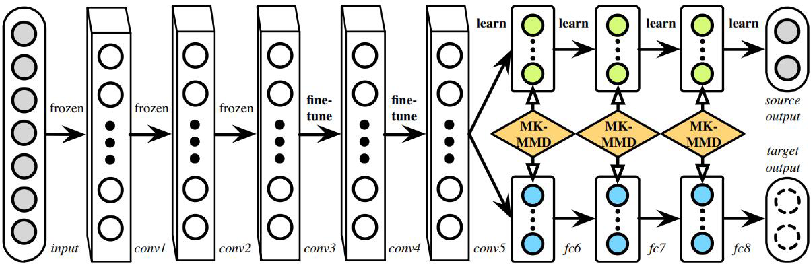
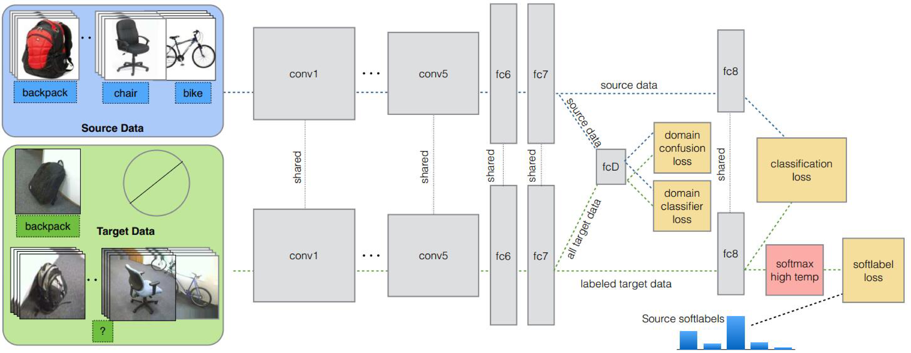
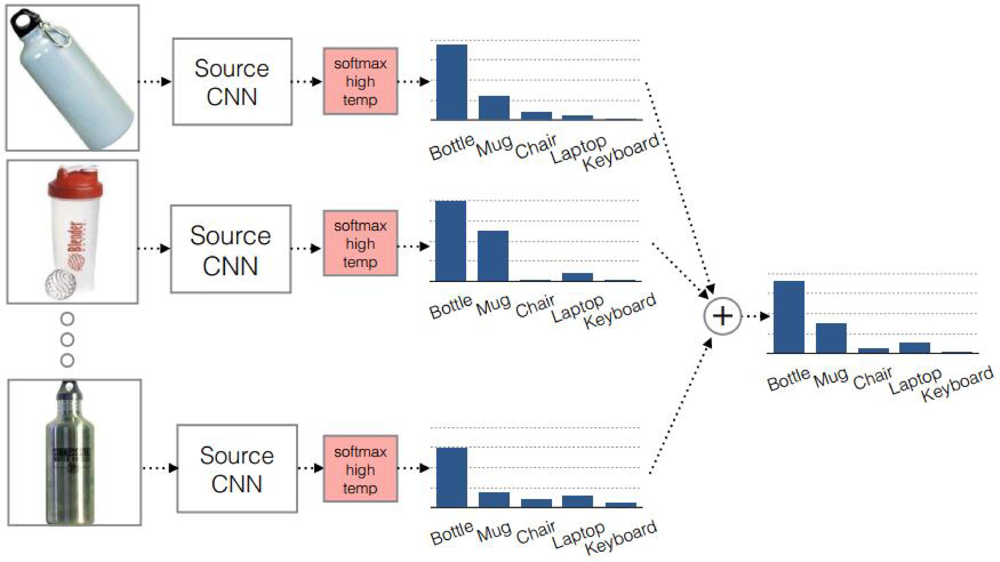

# 深度迁移方法

## 基本思路

深度网络的finetune可以帮助我们节省训练时间，提高学习精度。但是finetune有它的先天不足：它无法处理训练数据和测试数据分布不同的情况。而这一现象在实际应用中比比皆是。因为finetune的基本假设也是训练数据和测试数据服从相同的数据分布。这在迁移学习中也是不成立的。因此，我们需要更进一步，针对深度网络开发出更好的方法使之更好地完成迁移学习任务。

以我们之前介绍过的数据分布自适应方法为参考，许多深度学习方法([tzeng2014deep](https://arxiv.org/abs/1412.3474))都开发出了**自适应层(Adaptation Layer)**来完成源域和目标域数据的自适应。自适应能够使得源域和目标域的数据分布更加接近，从而使得网络的效果更好。

从上述的分析我们可以得出，深度网络的自适应主要完成两部分的工作：

一是哪些层可以自适应，这决定了网络的学习程度；

二是采用什么样的自适应方法(度量准则)，这决定了网络的泛化能力。

深度网络中最重要的是网络损失的定义。绝大多数深度迁移学习方法都采用了以下的损失定义方式：

$$
	\ell = \ell_c(\mathcal{D}_s,\mathbf{y}_s) + \lambda \ell_A(\mathcal{D}_s,\mathcal{D}_t)
$$

其中，$$\ell$$表示网络的最终损失，$$\ell_c(\mathcal{D}_s,\mathbf{y}_s)$$表示网络在有标注的数据(大部分是源域)上的常规分类损失(这与普通的深度网络完全一致)，$$\ell_A(\mathcal{D}_s,\mathcal{D}_t)$$表示网络的自适应损失。最后一部分是传统的深度网络所不具有的、迁移学习所独有的。此部分的表达与我们先前讨论过的源域和目标域的分布差异，在道理上是相同的。式中的$$\lambda$$是权衡两部分的权重参数。

上述的分析指导我们设计深度迁移网络的基本准则：决定自适应层，然后在这些层加入自适应度量，最后对网络进行finetune。

## 经典方法

前期的研究者在2014年环太平洋人工智能大会(PRICAI)上提出了一个叫做DaNN(Domain Adaptive Neural Network)的神经网络([ghifary2014domain](https://link.springer.com/chapter/10.1007/978-3-319-13560-1_76))。DaNN的结构异常简单，它仅由两层神经元组成：特征层和分类器层。作者的创新工作在于，在特征层后加入了一项MMD适配层，用来计算源域和目标域的距离，并将其加入网络的损失中进行训练。

但是，由于网络太浅，表征能力有限，故无法很有效地解决domain adaptation问题。因此，后续的研究者大多数都基于其思想进行扩充，如将浅层网络改为更深层的AlexNet、ResNet、VGG等；如将MMD换为多核的MMD等。

## DDC方法

加州大学伯克利分校的Tzeng等人~\cite{tzeng2014deep}首先提出了一个DDC方法(Deep Domain Confusion)解决深度网络的自适应问题([tzeng2014deep](https://arxiv.org/abs/1412.3474))。DDC遵循了我们上述讨论过的基本思路，采用了在ImageNet数据集上训练好的[AlexNet网络](http://papers.nips.cc/paper/4824-imagenet-classification-with-deep-convolutional-neural-networ)进行自适应学习。

下图是DDC方法的示意。DDC固定了AlexNet的前7层，在第8层(分类器前一层)上加入了自适应的度量。自适应度量方法采用了被广泛使用的MMD准则。

DDC方法的损失函数表示为：

$$
	\ell = \ell_c(\mathcal{D}_s,\mathbf{y}_s) + \lambda MMD^2(\mathcal{D}_s,\mathcal{D}_t)
$$

为什么选择了倒数第二层? DDC方法的作者在文章中提到，他们经过了多次实验，在不同的层进行了尝试，最终得出结论，在分类器前一层加入自适应可以达到最好的效果。

这也是与我们的认知相符合的。通常来说，分类器前一层即特征，在特征上加入自适应，也正是迁移学习要完成的工作。

自动选择迁移层的工作在最近的ICML 2019上被提出：https://zhuanlan.zhihu.com/p/66130006=。

## DAN方法

来自清华大学的龙明盛等人在2015年发表在机器学习顶级会议ICML上的DAN方法(Deep Adaptation Networks)([long2015learning](http://www.jmlr.org/proceedings/papers/v37/long15.pdf))对DDC方法进行了几个方面的扩展。首先，有别于DDC方法只加入一个自适应层，DAN方法同时加入了三个自适应层(分类器前三层)。其次，DAN方法采用了表征能力更好的**[多核MMD度量(MK-MMD)](http://papers.nips.cc/paper/4727-optimal-kernel-choice-for-large-scale-two-sample-tests)**代替了DDC方法中的单一核MMD。然后，DAN方法将多核MMD的参数学习融入到深度网络的训练中，不增加网络的额外训练时间。DAN方法在多个任务上都取得了比DDC更好的分类效果。

为什么是适配3层？原来的DDC方法只是适配了一层，现在DAN也基于AlexNet网络，适配最后三层（第6第7第8层）。为什么是这三层？因为在Jason的文章[yosinski2014transferable](http://papers.nips.cc/paper/5347-how-transferable-are-features-in-deep-n%E2%80%A6)中已经说了，网络的迁移能力在这三层开始就会特别地task-specific，所以要着重适配这三层。至于别的网络（比如GoogLeNet、VGG）等是不是这三层就需要通过自己的实验来推测。DAN只关注使用AlexNet。

MK-MMD的多核表示形式为

$$
	\mathcal{K} \triangleq \left\{k= \sum_{u=1}^{m}\beta_u k_u : \beta_u \ge 0, \forall u \right\}
$$

DAN的优化目标也由两部分组成：损失函数和自适应损失。损失函数这个好理解，基本上所有的机器学习方法都会定义一个损失函数，它来度量预测值和真实值的差异。分布距离就是我们上面提到的MK-MMD距离。于是，DAN的优化目标就是

$$
	\label{eq-deep-dan}
	\min_\Theta \frac{1}{n_a} \sum_{i=1}^{n_a} J(\theta(\mathbf{x}^a_i),y^a_i) + \lambda \sum_{l=l_1}^{l_2}d^2_k(\mathcal{D}^l_s,\mathcal{D}^l_t)
$$

这个式子中，$$\Theta$$表示网络的所有权重和bias参数，是用来学习的目标。其中$$l_1,l_2$$分别是6和8,表示网络适配是从第6层到第8层，前面的不进行适配。$$\mathbf{x}_a,n_a$$表示源域和目标域中所有有标注的数据的集合。$$J(\cdot)$$就定义了一个损失函数，在深度网络中一般都是cross-entropy。DAN的网络结构如下图所示。

DAN的学习一共分为两大类参数：学习网络参数$$\Theta$$和MMD的$$\beta$$。

对$$\Theta$$的学习依赖于MK-MMD距离的计算。通过kernel trick(类比以前的MMD变换)我们总是可以把MK-MMD展开成一堆内积的形式。然而，数据之间两两计算内积是非常复杂的，时间复杂度为$$O(n^2)$$，这个在深度学习中的开销非常之大。怎么办？作者在这里采用了Gretton在文章~\cite{gretton2012optimal}提出的对MK-MMD的无偏估计：$$d^2_k(p,q)=\frac{2}{n_s}\sum_{i=1}^{n_s/2}g_k(\mathbf{z}_i)$$，其中的$$\mathbf{z}_i$$是一个四元组：$$\mathbf{z}_i \triangleq (\mathbf{x}^s_{2i-1},\mathbf{x}^s_{2i},\mathbf{x}^t_{2i-1},\mathbf{x}^t_{2i})$$。将kernel作用到$$\mathbf{z}_i$$上以后，变成$$g_k(\mathbf{z}_i) \triangleq k(\mathbf{x}^s_{2i-1},\mathbf{x}^s_{2i})+k(\mathbf{x}^t_{2i-1},\mathbf{x}^t_{2i})-k(\mathbf{x}^s_{2i-1},\mathbf{x}^t_{2i})-k(\mathbf{x}^s_{2i},\mathbf{x}^t_{2i-1})$$。

上面这些变换看着很复杂。简单来说，它就是只计算了连续的一对数据的距离，再乘以2.这样就可以把时间复杂度降低到$$O(n)$$！至于具体的理论，可以去参考Gretton的论文，这里就不说了。

在具体进行SGD的时候，我们需要对所有的参数求导：对$$\Theta$$求导。在实际用multiple-kernel的时候，作者用的是多个高斯核。

学习$$\beta$$主要是为了确定多个kernel的权重。学习的时候，目标是：确保每个kernel生成的MMD距离的方差最小。也就是

$$
	\max_{k \in \mathcal{K}} d^2_k(\mathcal{D}^l_s,\mathcal{D}^l_t) \sigma^{-2}_k
$$

这里的$$\sigma^{-2}_k=E[g^2_k(\mathbf{z})]-[E(g_k(\mathbf{z}))]^2$$是估计方差。实际求解的时候问题可以被规约成一个二次规划问题求解，具体可以参照文章。

## 同时迁移领域和任务

DDC的作者Tzeng在2015年扩展了DDC方法，提出了领域和任务同时迁移的方法[tzeng2015simultaneous](http://openaccess.thecvf.com/content_iccv_2015/html/Tzeng_Simultaneous_Deep_Transfer_ICCV_2015_paper.html)。作者提出网络要进行两部分的迁移：

一是domain transfer，就是适配分布，特别地是指适配marginal distribution，但是没有考虑类别信息。如何做domain transfer：在传统深度网路的loss上，再加另一个confusion loss，作为classifier能否将两个domain进行分开的loss。两个loss一起计算，就是domain transfer。

二是task transfer，就是利用class之间的相似度，其实特指的是conditional distribution。类别之间有相似度，要利用上。类别之间的相似度：比如一个杯子与瓶子更相似，而与键盘不相似。文章的原话：it does not necessarily align the classes in the target with those in the source. Thus, we also explicity transfer the similarity structure amongst categories.

现有的深度迁移学习方法通常都只是考虑domain transfer，\textit{而没有考虑到类别之间的信息}。如何把domain和task transfer结合起来，是一个问题。

文章针对的情况是：target的部分class有少量label，剩下的class无label。

作者提出的方法名字叫做joint CNN architecture for domain and task transfer。最大的创新点是：现有的方法都是domain classifier加上一个domain confusion，就是适配。作者提出这些是不够的，因为忽略了类别之间的联系，所以提出了还要再加一个soft label loss。意思就是在source和target进行适配的时候，也要根据source的类别分布情况来进行调整target的。其实本意和JDA差不多。

相应地，文章的方法就是把这两个loss结合到一个新的CNN网络上，这个CNN是用AlexNet的结构修改成的。总的loss可以表示成几部分的和：

$$
L(x_S,y_S,x_T,y_T,\theta_D;\theta_{repr},\theta_C)=L_C(x_S,y_S,x_T,y_T;\theta_{repr},\theta_C) + \lambda L_{conf}(x_S,x_T,\theta_D;\theta_{repr})+v L_{soft}(x_T,y_T;\theta_{repr},\theta_C)
$$

Loss由三部分组成：第一部分是普通训练的loss，对应于经验风险最小化，所以作用到了所有有label的数据 $$x_S,y_S,x_T,y_T$$上；第二部分是现有方法也都做过的，就是domain adaptation，所以作用于 $$x_S,x_T$$上；第三部分是作者的贡献：新加的soft label的loss，只作用于target上。

网络结构如下图所示。网络由AlexNet修改而来，前面的几层都一样，区别只是在第fc7层后面加入了一个domain classifier，也就是进行domain adaptation的一层；在fc8后计算网络的loss和soft label的loss。

Domain confusion就不用多说，和现有的一些比如DAN和JAN一样，直接对source和target的margina distribution进行估计即可。

什么是soft label loss？这和作者的motivation有关。不仅仅要适配两个domain的marginal distribution，也要把类别信息考虑进去。而target中有大量数据没有label，怎么办呢？可以利用source中的label信息。具体做法是：在网络对source进行训练的时候，把source的每一个样本处于每一个类的概率都记下来，然后，对于所有样本，属于每一个类的概率就可以通过求和再平均得到。如下图所示。这样的目的是：根据source中的类别分布关系，来对target做相应的约束。比如，source中和bike最相似的class，肯定是motorbike，而不是truck。这样有一定的道理。

但是在我看来，这就是深度网络版的conditional distribution adaptation。因为也对应于得到了每个类的proportion。只不过作者在这里取了个“soft label loss”这个好听的名字，再冠以“task transfer”这样高大上的名字。下图是soft label的示意。

## AdaBN

与上述工作选择在已有网络层中增加适配层不同的是，北京大学的Haoyang Li和图森科技的Naiyan Wang等人提出了([AdaBN(Adaptive Batch Normalization)](https://arxiv.org/abs/1603.04779))，通过在归一化层加入统计特征的适配，从而完成迁移。

AdaBN对比其他方法，实现相当简单。并且，方法本身不带有任何额外的参数。在许多公开数据集上都取得了很好的效果。

## 小结

基于深度网络进行迁移学习，其核心在于，找到网络需要进行自适应的层，并且对这些层加上自适应的损失度量。越来越多的研究者开始使用深度网络进行迁移学习([long2016deep](http://papers.nips.cc/paper/6110-unsupervised-domain-adaptation-with-residual-transfer-networks), [zhuang2015supervised](https://www.aaai.org/ocs/index.php/IJCAI/IJCAI15/paper/viewPaper/10724), [sun2016deep](https://arxiv.org/abs/1607.01719), [luo2017label](http://papers.nips.cc/paper/6621-label-efficient-learning-of-transferable-representations-acrosss-domains-and-tasks))。在这其中，几乎绝大多数方法都采用了卷积神经网络，在已训练好的模型(如AlexNet、Inception、GoogLeNet、Resnet等)上进行迁移。

特别地，最近意大利的学者Carlucci等人在2017年计算机视觉领域顶级会议ICCV上提出了[自动深度网络自适应层(AutoDIAL, Automatic DomaIn Alignment Layers)](https://ieeexplore.ieee.org/abstract/document/8237804/)。该方法可以很简单地被加入现有的深度网络中，实现自动的自适应学习，使得深度网络的迁移更便捷。

由于篇幅和时间所限，我们未对所有新出现的研究工作给予介绍，仅在这里介绍了其中最具代表性的几种方法。但是绝大多数方法的原理都和我们已介绍过的大同小异。请读者持续关注最新发表的研究成果。