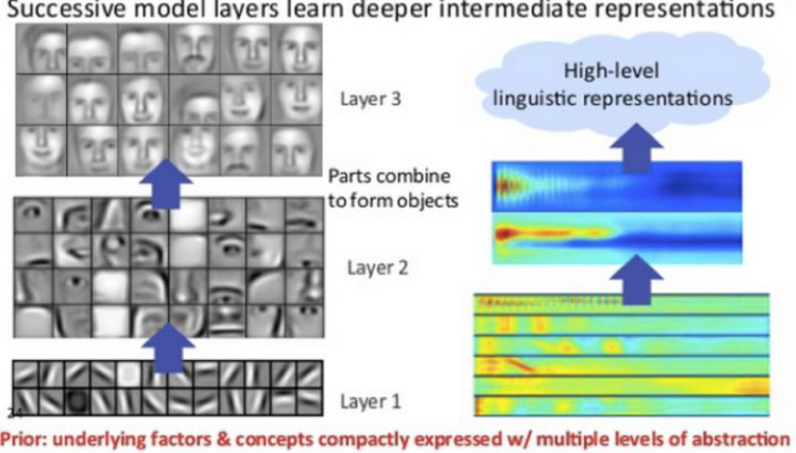
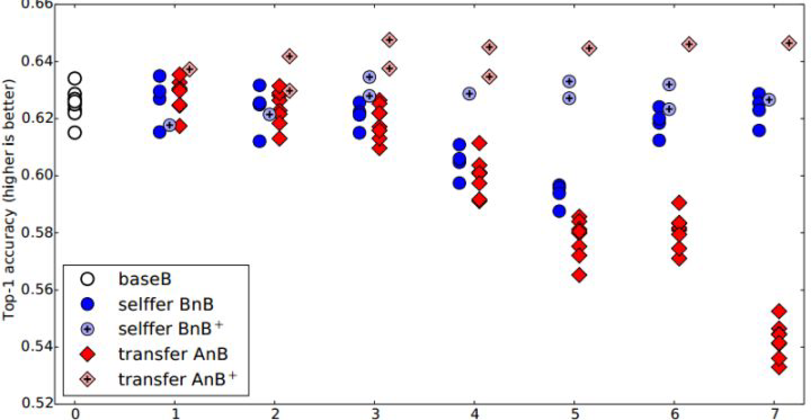
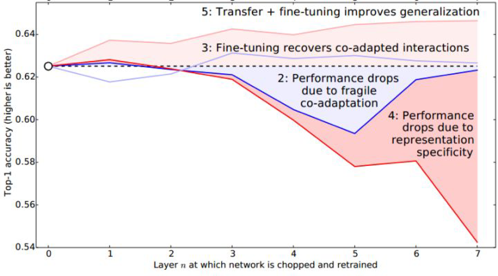

## 深度网络的可迁移性

随着[AlexNet](http://papers.nips.cc/paper/4824-imagenet-classification-with-deep-convolutional-neural-networ)在2012年的ImageNet大赛上获得冠军，深度学习开始在机器学习的研究和应用领域大放异彩。尽管取得了很好的结果，但是神经网络本身就像一个黑箱子，看得见，摸不着，解释性不好。由于神经网络具有良好的层次结构，很自然地就有人开始关注，能否通过这些层次结构来很好地解释网络？于是，有了我们熟知的例子：假设一个网络要识别一只猫，那么一开始它只能检测到一些边边角角的东西，和猫根本没有关系；然后可能会检测到一些线条和圆形；慢慢地，可以检测到有猫的区域；接着是猫腿、猫脸等等。下图是一个简单的示例。

这表达了一个什么事实呢？概括来说就是：前面几层都学习到的是通用的特征（general feature）；随着网络层次的加深，后面的网络更偏重于学习任务特定的特征（specific feature）。这非常好理解，我们也都很好接受。那么问题来了：如何得知哪些层能够学习到general feature，哪些层能够学习到specific feature。更进一步：**如果应用于迁移学习，如何决定该迁移哪些层、固定哪些层？**

这个问题对于理解神经网络以及深度迁移学习都有着非常重要的意义。

来自康奈尔大学的Jason Yosinski等人([yosinski2014transferable](http://papers.nips.cc/paper/5347-how-transferable-are-features-in-deep-n%E2%80%A6))率先进行了深度神经网络可迁移性的研究，将成果发表在2014年机器学习领域顶级会议NIPS上并做了口头汇报。该论文是一篇实验性质的文章（通篇没有一个公式）。其目的就是要探究上面我们提到的几个关键性问题。因此，文章的全部贡献都来自于实验及其结果。

在ImageNet的1000类上，作者把1000类分成两份（A和B），每份500个类别。然后，分别对A和B基于Caffe训练了一个AlexNet网络。一个AlexNet网络一共有8层，除去第8层是类别相关的网络无法迁移以外，作者在1到7这7层上逐层进行finetune实验，探索网络的可迁移性。

为了更好地说明finetune的结果，作者提出了有趣的概念：AnB和BnB。

迁移A网络的前$$n$$层到B（AnB） vs 固定B网络的前$$n$$层（BnB）

简单说一下什么叫AnB：（所有实验都是针对数据B来说的）将A网络的前$$n$$层拿来并将它frozen，剩下的$$8-n$$层随机初始化，然后对B进行分类。

相应地，有BnB：把训练好的B网络的前$$n$$层拿来并将它frozen，剩下的$$8-n$$层随机初始化，然后对B进行分类。

实验结果如下图所示：

这个图说明了什么呢？我们先看蓝色的BnB和BnB+(就是BnB加上finetune)。对BnB而言，原训练好的B模型的前3层直接拿来就可以用而不会对模型精度有什么损失。到了第4和第5层，精度略有下降，不过还是可以接受。然而到了第6第第7层，精度居然奇迹般地回升了！这是为什么？原因如下：对于一开始精度下降的第4第5层来说，确实是到了这一步，feature变得越来越specific，所以下降了。那对于第6第7层为什么精度又不变了？那是因为，整个网络就8层，我们固定了第6第7层，这个网络还能学什么呢？所以很自然地，精度和原来的B网络几乎一致！

对BnB+来说，结果基本上都保持不变。说明finetune对模型结果有着很好的促进作用！

我们重点关注AnB和AnB+。对AnB来说，直接将A网络的前3层迁移到B，貌似不会有什么影响，再一次说明，网络的前3层学到的几乎都是general feature！往后，到了第4第5层的时候，精度开始下降，我们直接说：一定是feature不general了!然而，到了第6第7层，精度出现了小小的提升后又下降，这又是为什么？作者在这里提出两点：co-adaptation和feature representation。就是说，第4第5层精度下降的时候，主要是由于A和B两个数据集的差异比较大，所以会下降；到了第6第7层，由于网络几乎不迭代了，学习能力太差，此时feature学不到，所以精度下降得更厉害。

再看AnB+。加入了finetune以后，AnB+的表现对于所有的$$n$$几乎都非常好，甚至比baseB（最初的B）还要好一些！这说明：finetune对于深度迁移有着非常好的促进作用！

把上面的结果合并就得到了下面一张图：

至此，AnB和BnB基本完成。作者又想，是不是我分A和B数据的时候，里面存在一些比较相似的类使结果好了？比如说A里有猫，B里有狮子，所以结果会好？为了排除这些影响，作者又分了一下数据集，这次使得A和B里几乎没有相似的类别。在这个条件下再做AnB，与原来精度比较（0\%为基准）得到了下图：

这个图说明了什么呢？简单：随着可迁移层数的增加，模型性能下降。但是，前3层仍然还是可以迁移的！同时，与随机初始化所有权重比较，迁移学习的精度是很高的!

## 结论

虽然该论文并没有提出一个创新方法，但是通过实验得到了以下几个结论，对以后的深度学习和深度迁移学习都有着非常高的指导意义：

- 神经网络的前3层基本都是general feature，进行迁移的效果会比较好；
- 深度迁移网络中加入fine-tune，效果会提升比较大，可能会比原网络效果还好；
- Fine-tune可以比较好地克服数据之间的差异性；
- 深度迁移网络要比随机初始化权重效果好；
- 网络层数的迁移可以加速网络的学习和优化。