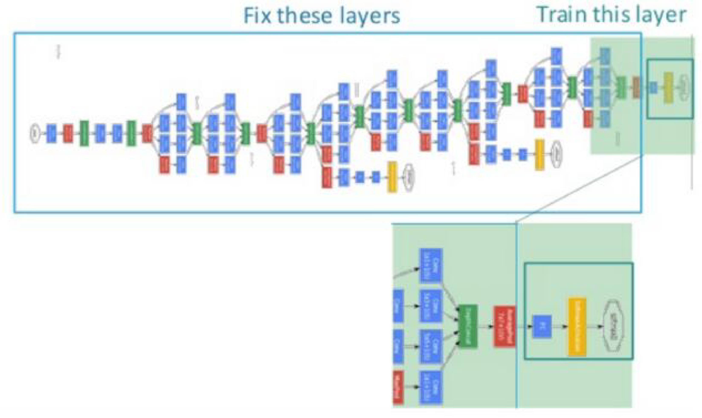

# 最简单的深度迁移：预训练与微调

深度网络的预训练-微调也许是最简单的深度网络迁移方法。Pretraining-finetune，也叫微调、finetuning，是深度学习中的一个重要概念。简而言之，finetune就是利用别人已经训练好的网络，针对自己的任务再进行调整。从这个意思上看，我们不难理解finetune是迁移学习的一部分。

## 为什么需要已经训练好的网络？

在实际的应用中，我们通常不会针对一个新任务，就去从头开始训练一个神经网络。这样的操作显然是非常耗时的。尤其是，我们的训练数据不可能像ImageNet那么大，可以训练出泛化能力足够强的深度神经网络。即使有如此之多的训练数据，我们从头开始训练，其代价也是不可承受的。

那么怎么办呢？迁移学习告诉我们，利用之前已经训练好的模型，将它很好地迁移到自己的任务上即可。

## 为什么需要finetune？

因为别人训练好的模型，可能并不是完全适用于我们自己的任务。可能别人的训练数据和我们的数据之间不服从同一个分布；可能别人的网络能做比我们的任务更多的事情；可能别人的网络比较复杂，我们的任务比较简单。

举一个例子来说，假如我们想训练一个猫狗图像二分类的神经网络，那么很有参考价值的就是在CIFAR-100上训练好的神经网络。但是CIFAR-100有100个类别，我们只需要2个类别。此时，就需要针对我们自己的任务，固定原始网络的相关层，修改网络的输出层，以使结果更符合我们的需要。

下图展示了一个简单的finetune过程。从图中我们可以看到，我们采用的预训练好的网络非常复杂，如果直接拿来从头开始训练，则时间成本会非常高昂。我们可以将此网络进行改造，固定前面若干层的参数，只针对我们的任务，微调后面若干层。这样，网络训练速度会极大地加快，而且对提高我们任务的表现也具有很大的促进作用。

## 预训练-微调的优势

Finetune的优势是显然的，包括：

- 不需要针对新任务从头开始训练网络，节省了时间成本；
- 预训练好的模型通常都是在大数据集上进行的，无形中扩充了我们的训练数据，使得模型更鲁棒、泛化能力更好；
- Finetune实现简单，使得我们只关注自己的任务即可。

## Finetune的应用与扩展

在实际应用中，通常几乎没有人会针对自己的新任务从头开始训练一个神经网络。Finetune是一个理想的选择。

Finetune并不只是针对深度神经网络有促进作用，对传统的非深度学习也有很好的效果。例如，finetune对传统的人工提取特征方法就进行了很好的替代。我们可以使用深度网络对原始数据进行训练，依赖网络提取出更丰富更有表现力的特征。然后，将这些特征作为传统机器学习方法的输入。这样的好处是显然的：既避免了繁复的手工特征提取，又能自动地提取出更有表现力的特征。

比如，图像领域的研究，一直是以SIFT、SURF等传统特征为依据的，直到2014年，伯克利的研究人员提出了DeCAF特征提取方法([donahue2014decaf](http://www.jmlr.org/proceedings/papers/v32/donahue14.pdf))，直接使用深度卷积神经网络进行特征提取。实验结果表明，该特征提取方法对比传统的图像特征，在精度上有着无可匹敌的优势。另外，也有研究人员用卷积神经网络提取的特征作为SVM分类器的输入([razavian2014cnn](https://www.cv-foundation.org/openaccess/content_cvpr_workshops_2014/W15/html/Razavian_CNN_Features_Off-the-Shelf_2014_CVPR_paper.html))，显著提升了图像分类的精度。

在NLP领域，2018年Google提出的[BERT模型](https://arxiv.org/abs/1810.04805)，几乎成为所有NLP任务进行预训练的起点。基于BERT，产生了大量的应用，这表明预训练已经在NLP领域大放异彩。